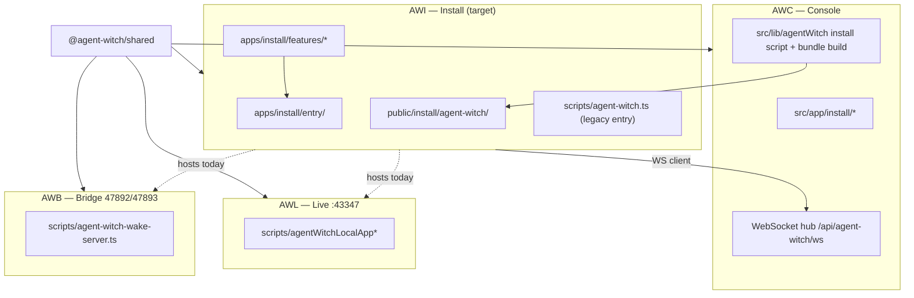

# AWI Fractal Slice Architecture plan

**Status:** Working plan (commit-worthy).  
**Deployable:** **AWI** — Agent Witch Install (`apps/install/`).  
**Policy:** [ADR 0007](../adr/0007-fractal-slice-architecture.md) · **Deployables:** [agent-witch-deployables.md](../product/agent-witch-deployables.md) · **Registry:** `apps/install/features.registry.json`.

## Goal

Move Mac install/runtime code from horizontal paths (`scripts/agent-witch.ts`, `public/install/agent-witch/`, `src/lib/agentWitch/` client/runtime) into **vertical FSA slices** under `apps/install/features/<slug>/`, without a big-bang move in one PR.

Cross-deployable contracts stay in **`@agent-witch/shared`** (`packages/shared/`). AWC continues to **serve/generate** install assets via `src/app/install` and `src/lib/agentWitch` until those paths are thin facades over AWI `public-api`.

## Boundary diagram



**Binding ownership (long-term):**

| Deployable              | Owns                                                                                                  | Must not live in AWI `features/`      |
| ----------------------- | ----------------------------------------------------------------------------------------------------- | ------------------------------------- |
| **AWI**                 | Install bundle, runtime process, LaunchAgents, self-update, WS client to AWC, `~/.agent-witch` layout | AWB wake HTTP server; AWL `:43347` UI |
| **AWB**                 | Loopback wake HTTP (`47892` / `47893`)                                                                | —                                     |
| **AWL**                 | Local app UI (`43347`)                                                                                | —                                     |
| **AWC**                 | Cloud UI, hub, install script **serving/generation**                                                  | Mac `~/.agent-witch` runtime          |
| **@agent-witch/shared** | Protocol, ports, deployable meta                                                                      | No `@/` imports into `src/`           |

## Target tree

```text
apps/install/
├── entry/                    # Thin CLI (future); today scripts/agent-witch.ts
├── features/
│   └── <slug>/
│       ├── public-api/
│       │   ├── types.ts
│       │   ├── presentation.ts
│       │   └── infrastructure.ts
│       └── internal/         # private — no cross-slice imports
├── features.registry.json
├── FSA.md                    # Pointer to this doc
└── README.md
```

Optional nested slice (later): `features/runtime-client/features/hub-connection/` — WebSocket + hub ack; same FSA shape.

## Feature slugs and mapping

| Slug                | `fsaStatus` (initial) | Owns (product)                                    | Main legacy paths (today)                                                                                      |
| ------------------- | --------------------- | ------------------------------------------------- | -------------------------------------------------------------------------------------------------------------- |
| `bundle`            | `in-progress`         | Shipped tarball/JS, `deps.tar.gz`, bundle version | `public/install/agent-witch/`, `scripts/buildAgentWitchInstallBundle.ts`, `AGENT_WITCH_INSTALL_BUNDLE_VERSION` |
| `install-layout`    | `in-progress`         | On-disk layout, profile paths, install roots      | `LOCAL_INSTALL_LAYOUT.md`, `resolveAgentWitchAppHome.ts`, install shell in `renderInstallAgentWitchScript*`    |
| `device-identity`   | `fsa`                 | Device keypair, pairing                           | `device-keypair.json`, pairing in client                                                                       |
| `macos-launch`      | `legacy`              | LaunchAgents, `run.sh`, login autostart           | `kickstartAgentWitchClientLaunchAgents*`, `com.agent-witch*` plist labels                                      |
| `runtime-client`    | `legacy`              | Main Node process, command dispatch               | `scripts/agent-witch.ts`, bundled `agent-witch.js`                                                             |
| `self-update`       | `fsa`                 | Bundle pull, `install-version.json`               | `agent-witch-self-update.ts`, updater LaunchAgent                                                              |
| `watchdog`          | `legacy`              | Stale client revive                               | `agent-witch-watchdog.ts`, watchdog LaunchAgent                                                                |
| `bundled-deps`      | `fsa`                 | `node-pty` prebuilds in `app/deps/`               | install extract step, `deps.tar.gz`                                                                            |
| `connection-health` | `fsa`                 | `connection-health.json`, hub ack snapshot        | client WS health writers                                                                                       |
| `uninstall`         | `fsa`                 | Remove install, agents                            | install script uninstall paths                                                                                 |

**Not AWI features:** AWB wake routes (`agent-witch-wake-server.ts`), AWL pages (`agentWitchLocalApp*`). Cross-links only in docs.

## Migration order (recommended PR slices)

1. **Scaffold + boundaries (this initiative)** — registry, placeholders, `public-api/types` for `install-layout` + `bundle`, vitest gates. No moves from `src/lib/agentWitch`.
2. **`install-layout`** — **done** — `resolveAgentWitchAppHome` + `resolveAgentWitchLocalLayout` live in `apps/install/features/install-layout/internal/core/`; `@agent-witch/install-layout` + shims in `src/lib/agentWitch/resolveAgentWitchAppHome.ts` and `scripts/resolveAgentWitchLocalLayout.ts`; registry `fsaStatus` = `fsa`.
3. **`bundle`** — version constant + install bundle build metadata; AWC keeps HTTP routes, calls AWI `public-api/infrastructure` when ready.
4. **`macos-launch`** + **`watchdog`** — **done** — kickstart/bootout, launch targets, service labels, console-user guard, and watchdog reinstall state live under `apps/install/features/macos-launch/` and `apps/install/features/watchdog/`; `@agent-witch/install-macos-launch` + `@agent-witch/install-watchdog` with `scripts/` shims; registry `fsaStatus` = `fsa`.
5. **`runtime-client`** — **in progress** — `readAgentWitchClientConfig`, `waitForAgentWitchClientConfigs`, `resolveRunProjectFolderPath`, and `resolveAgentWitchClientWsUrl` live under `apps/install/features/runtime-client/internal/core/`; `@agent-witch/install-runtime-client` + `scripts/readAgentWitchClientConfig.ts` shim; `apps/install/entry/agent-witch.ts` forwards to `scripts/agent-witch.ts`. **Still in `scripts/agent-witch.ts`:** `createAgentWitchClient`, WebSocket message dispatch, machine lease bootstrap, in-process services. Optional nested **`hub-connection`** later.
6. **`self-update`**, **`device-identity`**, **`connection-health`**, **`bundled-deps`**, **`uninstall`** — **done** — core logic under `apps/install/features/<slug>/internal/core/`; `@agent-witch/install-*` + `scripts/` shims; registry `fsaStatus` = `fsa`.
7. **Split process** — AWL/AWB out of single AWI process (separate deployable tracks; see [fsa-refactoring-plan.md](fsa-refactoring-plan.md) §0).

Each slice PR: one slug, shims for old import paths, `fsaStatus` bump, `npm run test:refactor-gate`.

## Test strategy

| Gate                                               | What it enforces                                                                                   |
| -------------------------------------------------- | -------------------------------------------------------------------------------------------------- |
| `test/awiFeaturesRegistry.test.ts`                 | `features.registry.json` schema; every slug has FSA `public-api/*` files or documented `fsaStatus` |
| `test/deployableBoundary.test.ts`                  | `packages/shared` does not import `src/`; `apps/install` does not import AWC `src/features/`       |
| `packages/shared/.../deployables.contract.test.ts` | Registry ↔ shared meta ↔ ports                                                                     |
| `test/deployables.registry.test.ts`                | AWI folder + README                                                                                |
| `npm run test:safety`                              | Fast tier includes boundary tests                                                                  |
| `npm run test:refactor-gate`                       | Standard tier + existing AWI vitest patterns in manifest                                           |

## Related

- [LOCAL_INSTALL_LAYOUT.md](../../src/features/agent-witch/LOCAL_INSTALL_LAYOUT.md)
- [refactoring-safety-tests.md](../development/refactoring-safety-tests.md)
- [apps/install/FSA.md](../../apps/install/FSA.md)
