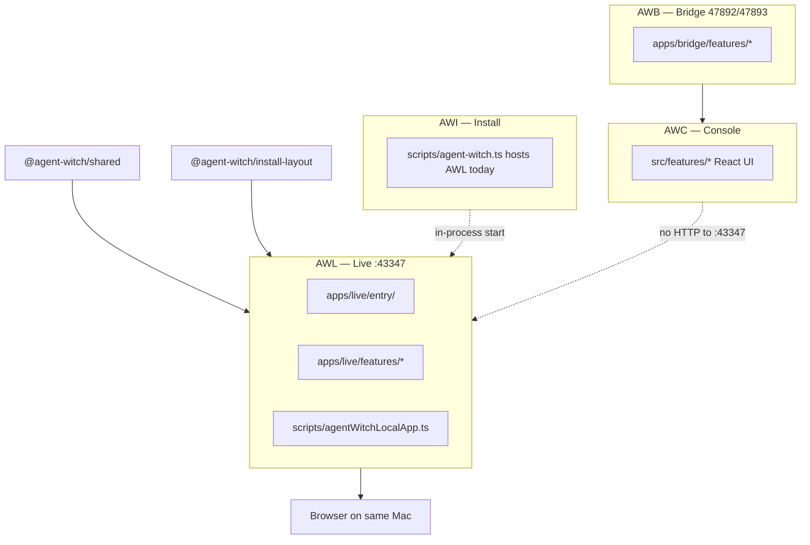

# AWL Fractal Slice Architecture plan

**Status:** AWL slices migrated (`fsaStatus: fsa` on all registry slugs). Entry: `apps/live/entry/startLocalAppServer.ts`; shim: `scripts/agentWitchLocalApp.ts`.  
**Deployable:** **AWL** — Agent Witch Live (`apps/live/`).  
**Policy:** [ADR 0007](../adr/0007-fractal-slice-architecture.md) · **Deployables:** [agent-witch-deployables.md](../product/agent-witch-deployables.md) · **Registry:** `apps/live/features.registry.json`.

## Goal

Move the Mac-local web app (`http://local.agentwitch.com:43347`, `127.0.0.1:43347`) from horizontal `scripts/agentWitchLocalApp*` and `scripts/localHarness/*` into **vertical FSA slices** under `apps/live/features/<slug>/`, without a big-bang move in one PR.

Cross-deployable contracts: **`@agent-witch/shared`** (live port/origins), **`@agent-witch/install-layout`** (profile paths on disk). AWC **must not** fetch AWL (AGENT-021).

## Boundary diagram



**Binding ownership:**

| Deployable | Owns                                                             | Must not live in AWL `features/`                              |
| ---------- | ---------------------------------------------------------------- | ------------------------------------------------------------- |
| **AWL**    | Local HTTP UI, HTML pages, Mac task/project/harness/knowledge UX | AWB wake server; AWC React; install bundle/LaunchAgents (AWI) |
| **AWI**    | Process host, WS client, install layout                          | `:43347` router and page builders                             |
| **AWB**    | Loopback APIs for browser-on-Mac + AWC                           | AWL product pages                                             |
| **AWC**    | Cloud console                                                    | Mac local app server                                          |

## Target tree

```text
apps/live/
├── entry/                    # startLocalAppServer(); today scripts/agentWitchLocalApp.ts
├── features/
│   └── <slug>/
│       ├── public-api/
│       │   ├── types.ts
│       │   ├── presentation.ts   # HTML builders (not React)
│       │   └── infrastructure.ts # Node HTTP handlers, FS
│       └── internal/
├── features.registry.json
├── FSA.md
└── README.md
```

For AWL, **`presentation.ts`** exports **server-rendered HTML** helpers used by **`local-server`** routing — not React components.

Optional nested slice (later): `features/harness/features/reveal/` for stream/cache reveal pipeline.

## Feature slugs and mapping

| Slug              | `fsaStatus` (initial) | Owns                                        | Main legacy paths (today)                                   |
| ----------------- | --------------------- | ------------------------------------------- | ----------------------------------------------------------- |
| `local-server`    | `fsa`                 | Bind `127.0.0.1:43347`, HTTP router         | `apps/live/features/local-server/` + entry shim             |
| `shell`           | `fsa`                 | App chrome, nav, cloud banner, update flash | `apps/live/features/shell/`                                 |
| `home`            | `fsa`                 | `/` dashboard                               | `apps/live/features/home/`                                  |
| `tasks`           | `fsa`                 | Local task page, self-delegated runs        | `apps/live/features/tasks/`                                 |
| `projects`        | `fsa`                 | Project registry, folders, cloud sync       | `apps/live/features/projects/`                              |
| `harness`         | `fsa`                 | Playbook reveal/install to Cursor           | `apps/live/features/harness/internal/core/localHarness/`    |
| `knowledge`       | `fsa`                 | RAG browse/query (`/knowledge`)             | `apps/live/features/knowledge/`                             |
| `memory`          | `fsa`                 | Local memory store UI                       | `apps/live/features/memory/`                                |
| `writer-settings` | `fsa`                 | Writer API / execution backend UI           | `apps/live/features/writer-settings/` (writer runtime: AWI) |
| `status-health`   | `fsa`                 | Connection health + heartbeat UI            | `apps/live/features/status-health/`                         |
| `diagnostics`     | `fsa`                 | Traffic/ws trace/error log pages            | `apps/live/features/diagnostics/`                           |
| `automations`     | `fsa`                 | Scheduled automations UI/tick               | `apps/live/features/automations/`                           |

## Migration order (recommended PR slices)

1. **Scaffold + boundaries (this initiative)** — registry, placeholders, `local-server` types wired to `@agent-witch/shared`, vitest gates. No moves from `scripts/agentWitchLocalApp.ts`.
2. **`local-server`** + **`shell`** — extract router + shell; shim `agentWitchLocalApp.ts`.
3. **`home`**, **`projects`**, **`tasks`** — core product routes.
4. **`harness`** — move `scripts/localHarness/` under slice `internal/`.
5. **`knowledge`**, **`memory`**, **`writer-settings`**.
6. **`status-health`**, **`diagnostics`**.
7. **`entry/local-app.ts`** — thin entry; `scripts/agentWitchLocalApp.ts` re-exports.
8. **Process split** — AWL started from AWI vs standalone (see [awi-fsa-plan.md](awi-fsa-plan.md) step 7).

Each slice PR: one slug (or paired small slices), shims, `fsaStatus` bump, `npm run test:refactor-gate`.

## Test strategy

| Gate                                               | What it enforces                                                 |
| -------------------------------------------------- | ---------------------------------------------------------------- |
| `test/awlFeaturesRegistry.test.ts`                 | Registry schema; every slug has FSA `public-api/*` + `internal/` |
| `test/deployableBoundary.test.ts`                  | `apps/live/features` does not import AWC `src/features/` or `@/` |
| `packages/shared/.../deployables.contract.test.ts` | AWL port/origin in registry                                      |
| `npm run test:safety`                              | Fast tier includes boundary tests                                |

## Related

- [awi-fsa-plan.md](awi-fsa-plan.md)
- [apps/live/FSA.md](../../apps/live/FSA.md)
- [refactoring-safety-tests.md](../development/refactoring-safety-tests.md)
