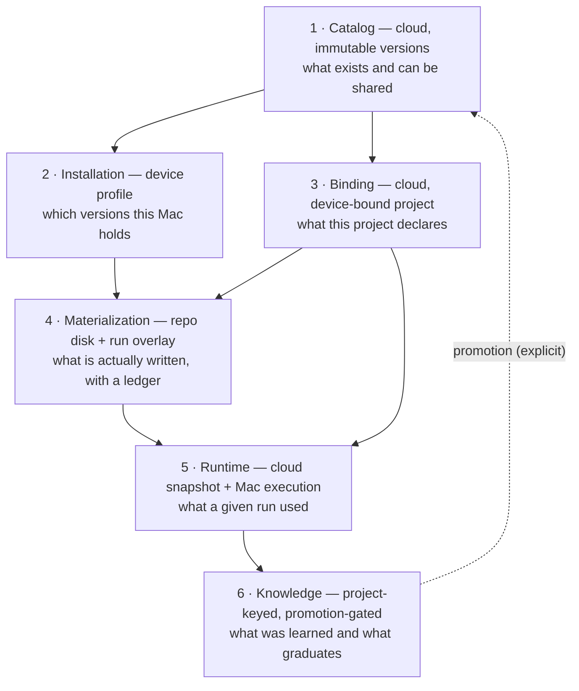
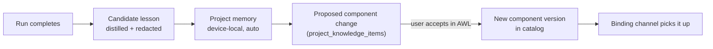

# Project composition architecture — Harness, Workflows, Agents

**Status:** Proposed (architect review) · **Decision record:** [ADR 0008](../adr/0008-project-composition-layers.md)

Scope: how a project's composition (Harness, Workflows, Agents) is stored, installed, bound, materialized into a repo, resolved at dispatch, and rolled forward as knowledge. Audience: engineering and PM working on `/projects` (AWC), `/project?id=` (AWL), harness install, and dispatch.

Companion docs: [projects UX v2 wireframes](../product/projects-view-wireframes-v2.md) · [deployables AWC/AWL/AWB/AWI](../product/agent-witch-deployables.md) · [concepts glossary](../product/concepts.md) · [ADR 0005 dispatch outbox](../adr/0005-shared-mac-presence-and-dispatch-outbox.md).

---

## 0. What exists today (audited, not assumed)

| Concern                | Where it lives now                                                                                        | Evidence                                                                             |
| ---------------------- | --------------------------------------------------------------------------------------------------------- | ------------------------------------------------------------------------------------ |
| Project record         | `user_projects` — 8 columns, no composition                                                               | `db/migrations/021-user-projects.sql`                                                |
| Composition (harness)  | `harnessSetSlugs: string[]` inside the repo at `<repo>/.agent-witch/project.json`                         | `applyInstalledHarnessSetsToProjectCursor`, `readAgentWitchProjectHarnessSetSlugs`   |
| Composition (workflow) | nowhere                                                                                                   | no project↔capability relation exists                                                |
| Composition (agent)    | nowhere                                                                                                   | same                                                                                 |
| Harness on the Mac     | `~/.agent-witch/harness/` with `manifest.json` → `sets[slug].items[]`, files in `shared/items/<itemId>/…` | `planHarnessInstallBundle`, `submitLocalHarnessSelection`                            |
| Materialization        | `fs.copyFileSync` into `<repo>/.cursor/…`, no record of what was written                                  | `applyInstalledHarnessSetsToProjectCursor`                                           |
| Cloud catalog          | `published_capabilities(type IN ('agent','workflow'), harness_set_slug TEXT)`                             | `db/schema.sql`                                                                      |
| Dispatch binding       | `projectFolderPath?: string` (a raw path) in the dispatch payload                                         | `parseAgentRunDispatchBody`, `resolveRunProjectFolderPath`                           |
| Run ↔ project          | **absent** — `agent_runs` has no `project_id` (only `agent_automations` does)                             | `db/schema.sql`, `db/migrations/022-agent-automations-project-id.sql`                |
| Knowledge              | `<repo>/.agent-witch/rag/chunks.ndjson`, `<repo>/.agent-witch/memory/runs.ndjson`                         | `agentWitchLocalRag.ts`, `agentWitchLocalMemory.ts`, `ensureAgentWitchProjectFolder` |

Correction to the brief: **`agent_runs.project_id` does not exist.** Any plan that assumes runs are already attributable to a project is building on a column that was never added. That absence is the single largest blocker for both the AWC read-only detail page and knowledge roll-forward.

---

## 1. Harsh critique

### 1.1 Composition is stored in the one place that cannot serve the UX

The only durable record of "what is installed in this project" is `harnessSetSlugs` in `<repo>/.agent-witch/project.json` — a file on one Mac, inside a folder the cloud has never read. UX v2 asks AWC to render `3 Harness · 2 Workflows · 5 Agents` on a list card and named items with versions on the detail page. AWC cannot compute either number. It cannot even compute zero honestly, because absence of data is indistinguishable from an empty project.

The workaround implied by the current shape — have AWC ask the Mac — fails the wireframe's own requirements: the list must render when the device is **offline** (there is an explicit offline card state), and it must render on a **phone** that is not the owning Mac. A read model that requires the writer to be online is not a read model.

### 1.2 The composition key is a per-owner slug, so it means different things to different people

Harness identity is `(owner_user_id, set_slug)` — see `harness_set_sharing`'s composite primary key and `harness_catalog_snapshots`' one-row-per-owner `manifest_json`. But the repo stores bare slugs. Two users with the same repo and the same `harnessSetSlugs: ["fsa-architecture"]` resolve to two different byte streams, with no way to detect the divergence. `published_capabilities.harness_set_slug` and `capability_versions.harness_set_slug` inherit the same defect at the catalog level: they are nullable free-text columns with no foreign key, so the "pinned" harness of a published capability version is a string that resolves to whatever that slug happens to mean on the installing machine today.

### 1.3 Materialization is a one-way copy with no ledger, so half the UX has no implementation path

`applyInstalledHarnessSetsToProjectCursor` does `mkdirSync` + `copyFileSync` into `<repo>/.cursor/` and then writes back only the list of applied slugs. It never records **which destination paths it wrote**. Three consequences:

- **`[ Remove ]` cannot be implemented.** Unchecking a set rewrites `harnessSetSlugs` and leaves every previously copied file in `.cursor/`. The declaration and the disk diverge on the first uncheck, permanently and silently.
- **`[ Update ]` cannot be implemented.** There is no record of what the previous version wrote, so an update cannot distinguish "file changed upstream" from "the user edited this rule by hand." The only available behavior is unconditional clobber.
- **User files are destroyed without warning.** `.cursor/rules/*.mdc` in a real repo is hand-authored. The copy overwrites by destination path with no diff, no prompt, and no backup.

### 1.4 Destination paths collide by construction

`planHarnessInstallBundle` derives the on-disk filename by slugifying the item **title**, and `resolveHarnessManifestItemCursorRelativePath` strips the `shared/items/<itemId>/` prefix on the way into the repo. So an item titled "Code style" in set A and an item titled "Code Style" in set B both land on `.cursor/rules/code-style.mdc`. The loop in `applyInstalledHarnessSetsToProjectCursor` iterates sets in order and copies unconditionally: last set wins, no error, no warning. Applying three sets and getting two files is a supported outcome of the current code.

### 1.5 There is no content identity, so "version" is decoration

Manifest items carry `id`, `kind`, `title`, `path` — no hash, no version. `HarnessManifestSet.version` increments on each submit, but `buildManifestItem` writes every version of an item to the **same** `shared/items/<itemId>/…` path, so the previous bytes are gone. The wireframe's `fsa-architecture v3.4 (update available)` requires comparing an installed version against a catalog version; neither side has a comparable identity. Worse, shared item files are keyed by item id alone, so two sets that include the same item alias the same file — re-submitting set A silently mutates the content that set B ships, without bumping set B's version.

### 1.6 Two nouns in one table, and the third noun has no table

`published_capabilities` carries `type IN ('agent','workflow')` plus `workflow_fields` and `operator_steps` on the same row, so an `agent` row exists with a permanently empty `workflow_fields` array and a `workflow` row carries agent-shaped columns. Harness — the third composition type, and the only one the project actually references — is not a first-class row anywhere; it exists only as a string key into a per-user JSONB blob. UX v2 asks for three peer types with identical affordances (Installed / Create new / Pull into repo). The schema offers one-and-a-half.

### 1.7 Dispatch binds a run to a path string, not to a project

The dispatch payload carries `projectFolderPath?: string`. On the Mac, `resolveRunProjectFolderPath` trims it and, when empty, **falls back to a default folder**. Nothing validates that the path belongs to a project, that the project belongs to the receiving device, or that the path still exists. Failure modes that are reachable today:

- **Change folder invalidates in-flight work.** A queued `agent_witch_dispatch_outbox` row holds the old absolute path in its JSONB payload. Rename the folder in AWL and the queued run executes in a directory that no longer matches the project.
- **Cross-device dispatch silently degrades.** `/Users/alex/code/daily-magic` dispatched to Jamie's Mac does not error; `ensureAgentWitchProjectFolder` calls `mkdirSync(..., { recursive: true })` and **creates** the directory tree, then runs the agent in an empty folder.
- **A typo becomes a new project.** Same `mkdirSync` path: a malformed folder string produces a silently created, knowledge-seeded directory instead of a validation error.

### 1.8 Runs are not attributable to projects

`agent_runs` has `capability_id`, `automation_id`, `device_id` — and no `project_id`. So: no per-project run history in AWC, no join from a run to the composition it ran under, no way to answer "which component version produced this output," and no cloud-side signal for knowledge roll-forward. `agent_automations.project_id` exists (migration 022), which means scheduled runs know their project and interactive runs do not — the inconsistency is not deliberate, it is drift.

### 1.9 Knowledge is keyed by a mutable path, and leaks across projects

`resolveAgentWitchProjectStorageLayout(folderPath)` derives the RAG and memory paths from the folder path. Therefore:

- Renaming or moving a folder orphans all accumulated knowledge, with no migration and no user-visible warning — while the wireframe offers `[ Change folder ]` as a routine action.
- `queryAgentWitchRag` falls back to the **install-wide** `~/.agent-witch/rag/chunks.ndjson` when no folder is supplied, so a folderless run reads chunks embedded from unrelated projects. That is a cross-project information leak inside a single user account, and a cross-customer one on a shared Mac.
- Retrieval is a full file read plus a brute-force cosine scan over unbounded append-only NDJSON, on every dispatch. There is no compaction, eviction, or index. The cost of the feature grows monotonically with use and nothing ever removes a chunk.

### 1.10 "Roll-forward" today is recency injection, not learning

`appendAgentWitchMemoryEntry` stores raw `prompt` + `output` pairs; `formatMemoryContextForPrompt` injects the last N **regardless of outcome**. A failed run's error output is injected into the next prompt with the same authority as a successful one. There is no distillation step, no success signal, no dedupe, and no path from "this run went well" to "make this a rule." `capability_improvements` exists in the cloud for exactly that purpose and is wired to nothing on the Mac. Separately, raw model output is re-injected verbatim, so a secret that appeared once in a transcript is replayed into every subsequent prompt — memory is an unaudited data-retention surface.

### 1.11 The repo-side `.agent-witch/` directory is a privacy accident waiting to happen

`ensureAgentWitchProjectFolder` creates `<repo>/.agent-witch/rag/chunks.ndjson` and `<repo>/.agent-witch/memory/runs.ndjson` inside a git working tree and **never writes a `.gitignore`**. A user who runs `git add -A` publishes embeddings of their source code and full run transcripts. The same directory also mixes three categories with different lifetimes — identity (`project.json`), derived cache (`rag/`), and private history (`memory/`) — under one undifferentiated root.

### 1.12 The project table contradicts device-bound projects in three places

- `folder_path TEXT NOT NULL` vs. the wireframe's explicit `No folder set yet` state and `[ Set folder → ]` CTA.
- `UNIQUE (owner_user_id, lower(name))` forbids the same repo name on two Macs — the exact scenario device-binding exists to support.
- `device_id ... ON DELETE SET NULL` plus `listUserProjectsForOwner`'s `device_id IS NULL OR device_id = $1` means unpaired projects appear on **every** Mac the user owns, and two Macs can both consider themselves the editor. Revoking a device orphans its projects into a state where AWL will not claim them and AWC, being read-only, cannot repair them.

### 1.13 Summary judgment

The current design is not a composition system with gaps; it is a **file-copy side effect with a slug list stapled to it**. Every UX v2 requirement that goes beyond "copy some files once" — counts in AWC, versions, update, remove, cross-project pull, per-project history, roll-forward — is blocked by the same three missing primitives: **content identity**, **a cloud-side binding record**, and **a materialization ledger**. Adding those three is most of the work; the rest is migration.

---

## 2. Layered architecture

Six layers, each with exactly one authority and one direction of dependency. A layer may read the layer below it; it may not write to it.



### Layer 1 — Catalog (authority: cloud)

**Owns:** the existence, identity, and immutable versions of every shareable component. One table for all three composition types, discriminated by `kind ∈ {harness, workflow, agent}`.

**Rules**

- A component has a stable `id`; `slug` is display/import sugar, unique only within `(owner_user_id, kind)`.
- A `component_version` is **immutable** once published. Editing produces a new version.
- Version content is a set of items addressed by `sha256`; identical bytes are stored once in `content_blobs`.
- Workflow fields, operator steps, and agent dispatch defaults live in `component_versions.spec` (JSONB), so they version with the content instead of mutating on the parent row.
- Harness becomes a first-class component. `harness_set_slug` columns are deprecated in favor of `component_version_id` references.

**Why:** everything downstream — "update available", cross-project pull, reproducible runs, drift detection — reduces to comparing two version ids or two content hashes. Without immutability here, none of them are computable.

### Layer 2 — Installation (authority: device profile, mirrored to cloud)

**Owns:** which component versions exist on a given Mac, under `~/.agent-witch/`. This is a **cache of the catalog**, not project state.

**Rules**

- Content-addressed store: `components/store/<sha256[0:2]>/<sha256>`, write-once, never mutated in place. This removes the cross-set aliasing bug in §1.5 by construction.
- Version manifests at `components/versions/<componentId>/<versionId>.json` map `relativePath → sha256`.
- `installed.json` lists installed `(componentId, versionId)` pairs. Multiple versions of one component may coexist.
- Installing is idempotent and never touches a repo. **Installation is not composition.**
- A `device_component_installs` row is written to the cloud on install, so AWC can show "installed on this Mac" and "update available" while the Mac is offline.

### Layer 3 — Binding (authority: cloud; sole writer: AWL)

**Owns:** what a project declares. This is the table that does not exist today and that the whole UX depends on.

**Rules**

- `project_components(project_id, component_id, kind, pinned_version_id, channel, enabled, materialize_target)` — one row per bound component, soft-deleted via `removed_at`.
- `channel ∈ {pinned, latest}`: `pinned` freezes `pinned_version_id`; `latest` resolves at snapshot time and is what surfaces "update available."
- **Binding does not require a folder.** A project with no folder can declare its composition; only materialization needs a path. This turns the wireframe's fully greyed-out tabs into a much better state: declare now, materialize when the folder is set.
- Cloud is authoritative because AWC must read composition when the Mac is offline. AWL is the only writer, which preserves the "one editable source of truth" principle without making AWC blind.
- `folder_path` moves **out** of `user_projects` into `project_device_bindings(project_id, device_id, folder_path, folder_verified_at, is_primary)`. Path is device truth; the cloud copy is an advisory mirror with a verification timestamp.

### Layer 4 — Materialization (authority: disk; always reversible)

**Owns:** turning bindings into files. Two targets, never conflated:

| Target     | Destination                                   | Lifetime      | Git-visible | Used by               |
| ---------- | --------------------------------------------- | ------------- | ----------- | --------------------- |
| `repo`     | `<repo>/.cursor/…`                            | until removed | yes         | pull **into project** |
| `run_only` | `~/.agent-witch/runs/<runId>/overlay/.cursor` | one run       | no          | pull **into task**    |

**Rules**

- Every write is recorded in `<repo>/.agent-witch/materialization.json`: `destinationPath → { componentId, versionId, sha256, mode, writtenAt, backupPath? }`. No write without a ledger entry.
- Destination paths are namespaced by component slug — `.cursor/rules/<componentSlug>/<stem>.mdc` — eliminating §1.4 collisions.
- Before writing, hash the existing file. If it exists and its hash matches no ledger entry, it is **user content**: copy it to `.agent-witch/backups/<timestamp>/` and report it in the result. If its hash matches an older version of the same component, it is a clean update. If it matches the current version, skip.
- Remove = delete exactly the ledger's paths for that component, restore a backup if one was displaced, drop the ledger entries.
- `<repo>/.agent-witch/.gitignore` is written on creation and ignores everything except `project.json`.

### Layer 5 — Runtime (authority: cloud for the snapshot, device for execution)

**Owns:** what a specific run actually used.

**Rules**

- Dispatch carries `projectId` (authoritative) and `folderPathHint` (advisory). The Mac resolves the folder from its own registry by `projectId`; a hint that disagrees is a warning, not an instruction. A `projectId` the device does not own is a **hard failure**, not a default-folder fallback.
- At dispatch, the server resolves bindings into an immutable `project_composition_snapshots` row: the resolved `(componentId, versionId, sha256)` list plus a digest. `agent_runs.composition_snapshot_id` points at it.
- Run-scoped components (pull into task) are appended to the snapshot with `scope: 'run'` and materialized to the overlay; they never create a binding.
- `agent_runs.project_id` is added and required for every composer/automation dispatch.
- The Mac verifies it holds every `sha256` in the snapshot before starting; missing blobs trigger a fetch, not a silent degradation.

### Layer 6 — Knowledge (authority: device by default; promotion is explicit)

**Owns:** what was learned, and the gate between "a run said something" and "this is now how we work."

**Rules**

- Keyed by `projectId`, not folder path. Storage lives at `~/.agent-witch/projects/<projectId>/knowledge/` with the repo folder holding only a pointer, so `[ Change folder ]` and repo moves preserve memory.
- Capture is **outcome-aware**: only runs that completed successfully (or were explicitly rated) produce memory candidates; failures are retained for debugging but excluded from prompt injection.
- Capture is **distilled**, not raw: a run produces a short candidate lesson, not a verbatim prompt/output pair. Redaction runs before persistence.
- Retrieval is scored by relevance **and** recency **and** outcome, with a bounded store (compaction on write, hard chunk ceiling per project).
- Roll-forward is a four-step promotion with a human gate at the end:



The first two steps are automatic and local. The third surfaces in AWL as "3 lessons ready to promote." The fourth publishes a catalog version and is the **only** way local knowledge becomes shared content — which also makes the privacy boundary explicit rather than incidental.

---

## 3. Target data model (ER)

```mermaid
erDiagram
    users ||--o{ projects : owns
    users ||--o{ components : owns
    agent_witch_devices ||--o{ project_device_bindings : hosts
    agent_witch_devices ||--o{ device_component_installs : holds

    components ||--o{ component_versions : "has versions"
    component_versions ||--o{ component_version_items : contains
    component_version_items }o--|| content_blobs : "sha256"
    component_versions ||--o{ device_component_installs : "installed as"

    projects ||--o{ project_device_bindings : "bound to devices"
    projects ||--o{ project_components : declares
    components ||--o{ project_components : "bound in"
    component_versions ||--o{ project_components : "pinned to"

    projects ||--o{ project_composition_snapshots : "resolved at dispatch"
    project_composition_snapshots ||--o{ agent_runs : "used by"
    projects ||--o{ agent_runs : "scoped to"
    agent_runs ||--o{ project_knowledge_items : "sourced from"
    projects ||--o{ project_knowledge_items : accumulates
    project_knowledge_items }o--o| component_versions : "promoted into"

    projects {
        text id PK
        text owner_user_id FK
        text name
        text slug
        text primary_device_id FK "nullable until bound"
        timestamptz last_used_at
        timestamptz archived_at
    }

    project_device_bindings {
        text project_id PK, FK
        text device_id PK, FK
        text folder_path "NULLABLE - device truth, cloud mirror"
        timestamptz folder_verified_at
        boolean is_primary "one true per project"
    }

    components {
        text id PK
        text owner_user_id FK
        text group_id FK
        text kind "harness|workflow|agent"
        text slug "unique per owner+kind"
        text name
        text visibility "private|group|public"
        text status "draft|published|archived"
        text current_version_id FK
        text forked_from_component_id FK
    }

    component_versions {
        text id PK
        text component_id FK
        integer version_number "unique per component"
        text changelog
        jsonb spec "workflow_fields, operator_steps, dispatch defaults"
        text manifest_digest "sha256 of item set"
        timestamptz published_at
    }

    component_version_items {
        text component_version_id PK, FK
        text relative_path PK
        text item_kind "rule|skill|command|agent|instruction"
        text title
        text content_sha256 FK
        integer byte_size
    }

    content_blobs {
        text sha256 PK
        integer byte_size
        text media_type
        text storage_ref
    }

    device_component_installs {
        text device_id PK, FK
        text component_version_id PK, FK
        timestamptz installed_at
        timestamptz last_verified_at
    }

    project_components {
        text id PK
        text project_id FK
        text component_id FK
        text kind "denormalized for list queries"
        text pinned_version_id FK "null when channel=latest"
        text channel "pinned|latest"
        boolean enabled
        text materialize_target "repo|run_only"
        text added_by_user_id FK
        timestamptz added_at
        timestamptz removed_at "soft delete"
    }

    project_composition_snapshots {
        text id PK
        text project_id FK
        jsonb resolved "componentId, versionId, sha256, scope"
        text digest
        timestamptz created_at
    }

    agent_runs {
        text id PK
        text project_id FK "NEW - required for composer dispatch"
        text composition_snapshot_id FK "NEW"
        text device_id FK
        text capability_id FK "deprecated - folds into snapshot"
        text folder_path_used "recorded, not commanded"
        text status
    }

    project_knowledge_items {
        text id PK
        text project_id FK
        text source_run_id FK
        text kind "lesson|fact|decision"
        text body "NULL while device-local"
        text sync_state "local|shared"
        text status "candidate|accepted|rejected|promoted"
        text promoted_component_version_id FK
        timestamptz created_at
    }
```



---

## 4. Cloud versus disk — who owns what

The rule is one authority per fact. Every other copy is a replica with a verification timestamp, and a replica is never used to overwrite its authority.

| Fact                                      | Authority                                            | Replica (and what it is for)                                                               | Reconciliation                                                                |
| ----------------------------------------- | ---------------------------------------------------- | ------------------------------------------------------------------------------------------ | ----------------------------------------------------------------------------- |
| Component exists, versions, content bytes | Cloud (`components`, `content_blobs`)                | Device store `~/.agent-witch/components/store/<sha256>` — offline execution                | Immutable; hash mismatch = corrupt cache, re-fetch                            |
| Which versions a Mac holds                | Device (`installed.json`)                            | Cloud `device_component_installs` — AWC shows state while offline                          | Mac reports on install and on heartbeat                                       |
| Project identity, name, device binding    | Cloud (`projects`)                                   | AWL `projects-registry.json` — offline project list                                        | Cloud wins; AWL merges on sync                                                |
| Project composition (bindings)            | Cloud (`project_components`)                         | none — AWL reads it live, does not cache as truth                                          | AWL is sole writer; writes are transactional in cloud                         |
| Folder path for a project on a Mac        | **Device**                                           | Cloud `project_device_bindings.folder_path` + `folder_verified_at` — so AWC can display it | Mac re-verifies existence on heartbeat; stale mirror is shown as "unverified" |
| Materialized files and the ledger         | **Disk** (`materialization.json`)                    | Cloud stores only a digest + counts for the AWC detail page                                | Drift = ledger hash ≠ file hash; AWL shows and offers repair                  |
| Run record, status, snapshot              | Cloud (`agent_runs`)                                 | Local run report under `~/.agent-witch/reports/`                                           | Cloud wins; local report is evidence, not state                               |
| Knowledge bodies (chunks, lessons)        | **Disk**, per `projectId`                            | Cloud only after explicit promotion                                                        | No implicit upload, ever                                                      |
| Knowledge candidates (metadata)           | Cloud (`project_knowledge_items` with `body = NULL`) | Disk holds the body                                                                        | Body uploads only when the user promotes                                      |

### Disk layouts

Device profile — a cache of the catalog plus device-local truth:

```text
~/.agent-witch/
  components/
    store/<sha256[0:2]>/<sha256>          # immutable content blobs, write-once
    versions/<componentId>/<versionId>.json  # relativePath -> sha256
    installed.json                         # [{ componentId, versionId, installedAt }]
  projects/
    registry.json                          # projectId -> { folderPath, verifiedAt }
    <projectId>/knowledge/
      lessons.ndjson                       # distilled, redacted, outcome-tagged
      chunks/                              # embeddings, compacted, bounded
  runs/<runId>/overlay/.cursor/            # run-scoped materialization, deleted on completion
  reports/
```

Repo — identity plus a reversibility ledger, and nothing else durable:

```text
<repo>/
  .cursor/
    rules/<componentSlug>/<stem>.mdc       # namespaced: no cross-component collisions
    skills/<componentSlug>/<slug>/SKILL.md
    commands/<componentSlug>/<stem>.md
  .agent-witch/
    .gitignore                             # ignore everything except project.json
    project.json                           # { schemaVersion, projectId, deviceId } — identity ONLY
    materialization.json                   # path -> { componentId, versionId, sha256, mode, writtenAt, backupPath? }
    backups/<timestamp>/                   # displaced user files, restorable
```

Two deliberate removals from the repo tree: **`harnessSetSlugs` (composition moves to cloud)** and **`rag/` + `memory/` (knowledge moves to the profile, keyed by `projectId`)**. What remains in the repo is exactly what must travel with the repo: identity and a record of what was written into it.

---

## 5. Pull into project versus pull into task

This is the distinction the current code cannot express, and the one that decides whether the repo stays clean.

|                                  | **Pull into project** (bind)                             | **Pull into task** (run-scoped)                          |
| -------------------------------- | -------------------------------------------------------- | -------------------------------------------------------- |
| Intent                           | "This is how this repo works from now on"                | "Use this for this one task"                             |
| Cloud write                      | `project_components` row                                 | none — recorded in the run's snapshot as `scope: 'run'`  |
| Disk write                       | `.cursor/…` in the repo, ledger entry                    | `~/.agent-witch/runs/<runId>/overlay/.cursor`, no ledger |
| Git impact                       | dirties the working tree — intentional, reviewable       | none, ever                                               |
| Version resolution               | at bind time (`pinned`) or at each snapshot (`latest`)   | at dispatch time, frozen into the snapshot               |
| Visible in AWC detail            | yes — counts and named items                             | no — appears only on the run detail                      |
| Requires the owning Mac          | yes (AWL is the only writer)                             | no — the AWC composer can add run-scoped components      |
| Requires a folder                | **no** — declare now, materialize when the folder is set | no — the overlay does not need the repo                  |
| Reversal                         | `[ Remove ]` — ledger-driven delete plus backup restore  | automatic: the overlay is deleted when the run ends      |
| Failure if the device is offline | blocked with a reason (the wireframe's disabled CTA)     | queued in the dispatch outbox like any other run         |

**Escalation is the product feature, not an afterthought.** A run report that used run-scoped components shows `[ Keep in project ]`. Accepting it creates a binding pinned to the exact version the run used — taken from the snapshot, not re-resolved. That is the safe, evidence-backed way composition grows: try it on one task, keep it if it worked.

**Demotion exists too.** `[ Remove ]` on a bound component offers "remove from project" and "keep for this Mac only" (unbind but leave installed), so removing a rule from a repo never forces a re-download.

Practical guidance for callers:

- The AWC composer may only ever pull **into task**. It is read-only with respect to composition, and this rule is what makes that constraint enforceable rather than aspirational.
- AWL's per-tab `[ Pull into repo ▾ ]` is pull **into project**, and it must run a drift check and show a diff summary before writing.
- Automations (`agent_automations.project_id`) always use the project's bindings; they may not carry run-scoped components, because nobody is present to review an overlay that runs at 3am.

---

## 6. Phased PR plan

Each phase is independently shippable and independently revertible. Migration numbering continues from `027-agent-witch-hub-dispatch-relay.sql`.

### P0 — Run identity (unblocks everything; no file behavior changes)

- Migration `028`: `agent_runs.project_id TEXT REFERENCES user_projects(id) ON DELETE SET NULL`, index `(project_id, created_at DESC)`.
- Dispatch payload carries `projectId` alongside the existing `projectFolderPath`; `parseAgentRunDispatchBody` and `readWriterRunDispatchPayloadFields` accept both.
- Mac: when `projectId` is present, resolve the folder from the local registry and treat the path as a hint. When `projectId` is present but unknown to this device, **fail the run with a clear message** instead of falling back to the default folder.
- Tests: dispatch parse round-trip; unknown-project rejection; hint/registry disagreement logs a warning and uses the registry.
- Risk: low. Old clients ignore the new field and keep current behavior.
- Exit: every composer- and automation-originated run has a `project_id`.

### P1 — Materialization ledger and safe writes (disk only, no migration)

- Write `materialization.json` on every apply; write `.agent-witch/.gitignore` on folder creation.
- Namespace destinations by component slug; add pre-write hashing, user-file backup, and a result summary of written/skipped/backed-up paths.
- Implement remove (ledger-driven delete plus restore) and drift detection.
- Tests: collision between two sets with the same item title; uncheck-then-remove leaves no orphans; hand-edited file is backed up, not clobbered; re-apply of an unchanged version is a no-op.
- Risk: medium — this is the first change to on-disk behavior. Ship behind a one-time migration that scans `.cursor/` and adopts files matching known harness content into the ledger; anything unmatched is left alone and reported.
- Exit: `[ Remove ]` and `[ Update ]` in the AWL wireframe are implementable.

### P2 — Content identity in the device store

- Content-address `~/.agent-witch/components/store/<sha256>`; per-version manifests; `installed.json` with `(componentId, versionId)`.
- Keep reading the legacy `harness/manifest.json` and import it into the new store on first run.
- Tests: two versions coexist; re-submitting one set does not mutate another set's bytes; corrupt blob is detected by hash and re-fetched.
- Exit: "update available" is computable locally; §1.5 aliasing is gone.

### P3 — Catalog unification (cloud)

- Migration `029`: `components`, `component_versions`, `component_version_items`, `content_blobs`, `device_component_installs`.
- Backfill: `published_capabilities` → `components(kind = type)`; `capability_versions` → `component_versions`; `harness_catalog_snapshots.manifest_json` → harness `components` + versions + items + blobs.
- Keep `published_capabilities` readable as a view during transition; deprecate `harness_set_slug` (stop writing, keep reading).
- Tests: backfill idempotency; slug collisions across owners resolve to distinct components; existing marketplace and borrow flows return identical payloads pre/post.
- Risk: highest of the plan. Gate on a dry-run backfill against a production snapshot and a read-path diff harness.
- Exit: harness, workflow, and agent share one id space and one versioning story.

### P4 — Binding table and the AWC read-only detail page

- Migration `030`: `project_components`, `project_device_bindings`; make `user_projects.folder_path` nullable; replace `UNIQUE (owner_user_id, lower(name))` with `UNIQUE (owner_user_id, device_id, lower(name))`; stop returning `device_id IS NULL` projects on every device.
- Backfill bindings from each Mac's `harnessSetSlugs` on first AWL sync after upgrade (the Mac is the only place this data exists; the cloud cannot backfill it alone).
- AWL writes bindings; AWC `/projects` and `/projects/{id}` render counts, names, and versions from cloud only.
- Allow binding without a folder; block only materialization.
- Tests: AWC detail renders with the device offline; unbound project is not editable from two Macs; same repo name on two Macs is accepted.
- Exit: the UX v2 AWC surfaces are implementable without asking the Mac anything.

### P5 — Composition snapshots and run-scoped pull

- Migration `031`: `project_composition_snapshots`; `agent_runs.composition_snapshot_id`.
- Resolve bindings to a snapshot at dispatch; send the snapshot with the run; Mac verifies blob availability before start.
- Implement pull-into-task: run overlay materialization, `scope: 'run'` entries, overlay cleanup on completion, and `[ Keep in project ]` on the run report.
- Tests: a run replays with identical versions after the binding changes; overlay is deleted on success, failure, and crash-recovery; automations reject run-scoped components.
- Exit: runs are reproducible and the composer can stay read-only with respect to composition.

### P6 — Knowledge re-keying and roll-forward

- Move knowledge to `~/.agent-witch/projects/<projectId>/knowledge/`, migrating existing per-folder stores by matching `project.json`; leave a pointer in the repo.
- Remove the install-wide RAG fallback (a run without a project gets **no** retrieved context rather than another project's).
- Outcome-aware capture, distillation, redaction, compaction, and a per-project chunk ceiling.
- Migration `032`: `project_knowledge_items` (bodies nullable, `sync_state`); AWL "lessons ready to promote"; promotion publishes a new component version.
- Tests: `[ Change folder ]` preserves memory; a failed run's output is not injected; redaction fixtures; compaction keeps retrieval bounded.
- Exit: roll-forward is a reviewable pipeline instead of recency injection.

### P7 — Removal of the old shape

- Delete `readAgentWitchProjectHarnessSetSlugs` and `harnessSetSlugs` writes; drop `published_capabilities.harness_set_slug` and `capability_versions.harness_set_slug`; remove the default-folder fallback for project-scoped dispatch entirely.
- Add a structure/architecture check that fails on new writes to composition state inside a repo folder.
- Exit: one representation per fact.

**Sequencing constraints.** P0 and P1 are independent and can run in parallel. P2 must precede P3's harness backfill. P4 depends on P3 for component ids. P5 depends on P4. P6 depends on P0 for run attribution. P7 is last.

---

## 7. Architect sign-off

**I sign off on this design**, with the conditions below. The reasoning: the six layers each have one authority, the dependency arrows never reverse, and every UX v2 affordance that is impossible today (`Remove`, `Update`, version labels, offline AWC counts, per-project history, cross-project pull) becomes a straightforward read or diff once content identity, bindings, and the ledger exist. Nothing in the plan requires AWC to acquire write access to composition, so the "one editable source of truth" principle survives intact — it is enforced by table ownership rather than by convention.

**Conditions of sign-off**

1. **P1 ships before any new materialization feature.** Writing more files into user repos without a ledger deepens a hole we already cannot climb out of. I would block any PR that adds a new copy path before the ledger exists.
2. **P3's backfill runs as a dry run against a production snapshot first**, with a read-path diff harness proving marketplace, borrow, and capability reads are byte-identical before and after. This is the only phase that can corrupt existing user data.
3. **No implicit knowledge upload, in any phase.** `project_knowledge_items.body` stays `NULL` until a user explicitly promotes. If a phase needs bodies in the cloud for convenience, that phase does not ship.
4. **The default-folder fallback is removed, not softened.** A dispatch that names a project the device does not own must fail loudly. Silently running an agent in the wrong directory is the worst failure mode this product has.
5. **Run-scoped components never touch the repo working tree.** If overlay materialization proves impractical for a given writer CLI, the correct answer is to disable pull-into-task for that CLI, not to fall back to writing `.cursor/`.

**What I am explicitly accepting as debt**

- `published_capabilities` survives as a view through P3–P6. Two names for one concept is confusing, but a big-bang rename across marketplace, library, automations, and improvements is riskier than the confusion.
- `project_device_bindings` supports multiple devices per project while the UX v2 exposes only one primary. The extra row is cheap; retrofitting multi-device onto a single-column binding is not.
- Knowledge compaction in P6 is heuristic (recency + outcome + relevance with a hard ceiling). It will need tuning with real data; the layering means tuning it does not touch any other layer.

**What I would reject if proposed**

- Storing composition in the repo "as well, for convenience." Two authorities for one fact is how the current design broke.
- Having AWC read composition by calling the Mac. The offline and phone cases in the wireframes make this a non-starter, and it inverts the dependency direction.
- Making `Agents` a separate table because the name collides with "agent run." The collision is a naming problem and should be solved in copy (`concepts.md`), not in the schema.

**Open questions for product, not blocking**

- What happens to a project whose only Mac is revoked? The schema allows rebinding to another device; UX v2 has no screen for it, and AWC is read-only. Rebinding is not composition editing, so I recommend allowing it in AWC.
- Deleting a project leaves `~/.agent-witch/projects/<projectId>/knowledge/` behind. The wireframe's delete modal promises the folder is untouched; it should also say whether memory is purged, and offer the choice.
