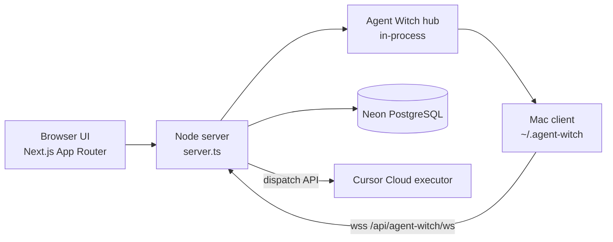

# System map

## Components

## Custom server

Production and local dev use **`tsx server.ts`** (`npm run dev` / `npm start`):

- Serves the Next.js app and **`GET /api/health`**.
- Terminates **WebSocket** upgrades on **`/api/agent-witch/ws`** (path configurable via `AGENT_WITCH_WS_PATH`).
- Hosts the in-memory **Agent Witch hub** (`getAgentWitchHub`) and connection registry maintenance.

Plain `next dev` (`npm run dev:next`) does **not** provide the Mac bridge. See [ADR 0002](../adr/0002-custom-server-for-agent-witch-websocket.md).

## Origins and trust

- Production browser and Mac clients target **`https://www.agentwitch.com`** (hardcoded production `wss` for installs — see [repo-name-and-hosting](../product/repo-name-and-hosting.md)).
- HTTP and WebSocket must share the **same origin**.
- Cursor Cloud dispatch enforces allowed app origins in production — [ADR 0004](../adr/0004-cursor-cloud-dispatch-origin.md).

## Data and async work

- **Neon** holds users, sessions, devices, capabilities, dispatch outbox, run history, etc. Schema: `db/schema.sql`; apply via `npm run db:migrate` or `db:schema`.
- **Presence tiers** and **dispatch outbox** coordinate multi-instance and Mac writer vs queued work — [ADR 0005](../adr/0005-shared-mac-presence-and-dispatch-outbox.md).
- **Hosting**: long-lived Node on Railway (Docker) for production WebSocket + app — [ADR 0006](../adr/0006-production-hosting-and-neon.md).

## Security

Trust boundaries and scenarios: [security/threat-model.md](../security/threat-model.md).
