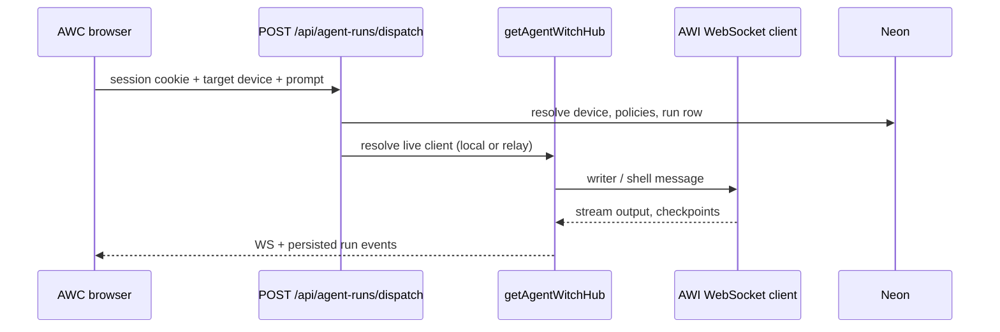

# Chapter 5 — Dispatch, presence, and runs

**Dispatch** routes work to a paired Mac or **Cursor Cloud**; an **agent run** is one execution with streamed events and Reports history. User flows: [user guide ch.5 — Tasks, dispatch, and runs](../user-guide/05-tasks-dispatch-and-runs.md).

Server core: `src/lib/dispatch/` · UI `src/features/dispatch/`, `src/features/agent/`, `src/features/reports/` · primary API **`POST /api/agent-runs/dispatch`**.

Binding ADRs: [0004](../../adr/0004-cursor-cloud-dispatch-origin.md) (cloud origin) · [0005](../../adr/0005-shared-mac-presence-and-dispatch-outbox.md) (presence, outbox, relay).

---

## End-to-end flow (writer task)



Composer UI: `/agent` · smoke UI: `/ws-test` · history: `/reports`.

---

## Dispatch targets

| Target       | Identifier                                       | Executes on                  |
| ------------ | ------------------------------------------------ | ---------------------------- |
| Paired Mac   | Device id from `/api/agent-witch/devices`        | Mac writer CLI / PTY via hub |
| Cursor Cloud | `__cursor_cloud__` / `writerAgent: cursor-cloud` | Cloud executor (no Mac)      |

Routing cascade (continuation vs memory budget): [docs/qa/writer-dispatch-cascade-routing.md](../../qa/writer-dispatch-cascade-routing.md).

**Production Cursor Cloud:** request `Origin` or `Referer` host must match app base URL (ADR 0004). Local dev skips for ergonomics.

---

## Presence tiers (do not conflate)

`GET /api/agent-witch/devices` exposes **`presenceTier`** per device (ADR 0005):

| Tier                  | Meaning                                   | Writer send-a-task              |
| --------------------- | ----------------------------------------- | ------------------------------- |
| `live`                | Socket on **this** Node hub               | Allowed                         |
| `live_other_instance` | Registry: socket on another `instance_id` | Relay or retry / sticky routing |
| `recent`              | `last_seen_at` ~90s, no live socket       | Not allowed                     |
| `offline`             | Otherwise                                 | Not allowed                     |

- **`isOnline`** — visibility / wake hints (`live`, `live_other_instance`, or `recent`).
- **`isDispatchReady`** — writer-ready; only **`live`** on this process (and relay path for other instance).
- Home “Mac online” hero counts **`live`** on this process only — `live_other_instance` shows reconnecting UX.

Unified resolver (devices API + dispatch must match): `resolveLiveAgentClientsByDeviceIdForUser` (see ADR 0005 full text).

Cookie: **`aw_hub_instance`** from devices GET — optional load-balancer stickiness to socket-owning replica.

---

## Postgres registries

### `agent_witch_connections`

One row per live WebSocket; keyed by `client_id`, tied to `device_id`, `user_id`, `instance_id`. Maintained on register, heartbeat ack, close, and instance startup sweep.

### `agent_witch_dispatch_outbox`

Queueable work when Mac is not live on the handling node:

- **Queued examples:** harness install, harness write-items, capability template install, marketplace push, automation dispatch.
- **Not queued:** `shell.*`, `writer.*`, `writer.input.respond`, `writer.stop` — need live hub session (fail fast or **relay**).

Idempotency via **`idempotency_key`**.

### `agent_witch_hub_dispatch_relay`

Short-lived relay when registry shows Mac **live on another instance**: dispatch HTTP handler enqueues relay; owner instance drains and runs writer dispatch locally (~15s poll window). Writer runs are **not** created as queued `running` without hub resolution (AGENT-022).

Operational symptom doc: [docs/qa/awc-mac-reconnecting-vs-local-live.md](../../qa/awc-mac-reconnecting-vs-local-live.md) · `src/features/agent-witch/KNOWN_ISSUES.md`.

---

## Approvals, policy, and mid-run input

| Area                          | Location                                                                     |
| ----------------------------- | ---------------------------------------------------------------------------- |
| Dispatch policy API           | `/api/agent-witch/dispatch-policy`                                           |
| Approvals UI                  | `src/features/dispatch/DispatchApprovalListener.tsx`                         |
| `[[AWAITING_INPUT]]` protocol | `.cursor/rules/agent-run-input-protocol.mdc` · Mac `pending-run-inputs.json` |
| Dev dashboard limits          | `AGENT_WITCH_DEV_DASHBOARD=1` — no team delegation QA                        |

Workflow checkpoints (official runs): [user guide ch.6](../user-guide/06-workflows-and-checkpoints.md) · developer [Chapter 6](06-workflows-orchestration.md).

---

## Harness vs workflow dispatch

- **Harness install** — files under `~/.agent-witch/harness/` via AWB `POST /harness/install` or outbox when Mac offline.
- **Workflow / agent command** — `command.claude.run` over Mac WebSocket when dispatch selects Mac.

See [docs/qa/mac-harness-workflow-agent-dispatch.md](../../qa/mac-harness-workflow-agent-dispatch.md).

---

## Testing dispatch locally

1. [Chapter 1](01-local-dev-and-env.md) — `npm run dev`, correct `DATABASE_URL`.
2. [Chapter 2](02-auth-and-test-login.md) — session cookie (or dev dashboard for `/ws-test` only).
3. [Chapter 4](04-mac-bridge-awl-awb-awi.md) — `npm run agent-witch` for Mac path.
4. Send task from `/agent` or `/ws-test`; watch `/reports` and hub logs.

E2E examples: `e2e/self-delegate.spec.ts`, `e2e/progress-detail.spec.ts` (wait on `/api/agent-runs/dispatch`).

---

## Related

| Topic                 | Link                                                                               |
| --------------------- | ---------------------------------------------------------------------------------- |
| User tasks & terminal | [user guide ch.5](../user-guide/05-tasks-dispatch-and-runs.md)                     |
| Domain                | [dispatch-and-runs.md](../../domains/dispatch-and-runs.md)                         |
| Send readiness codes  | [send-readiness-reason-codes.md](../../agent-witch/send-readiness-reason-codes.md) |
| Architecture          | [Chapter 3](03-architecture-map.md)                                                |

```bash
npm run feature-knowledge:query -- "presence tier live_other_instance" --feature=docs
npm run feature-knowledge:query -- "dispatch outbox" --feature=dispatch
```

---

## Query aliases

- dispatch presence live_other_instance outbox agent_witch_connections
- POST /api/agent-runs/dispatch Cursor Cloud **cursor_cloud**
- Mac not online reconnecting writer relay hub
- gửi task Agent Witch, dispatch Mac, tier presence, hàng đợi outbox
