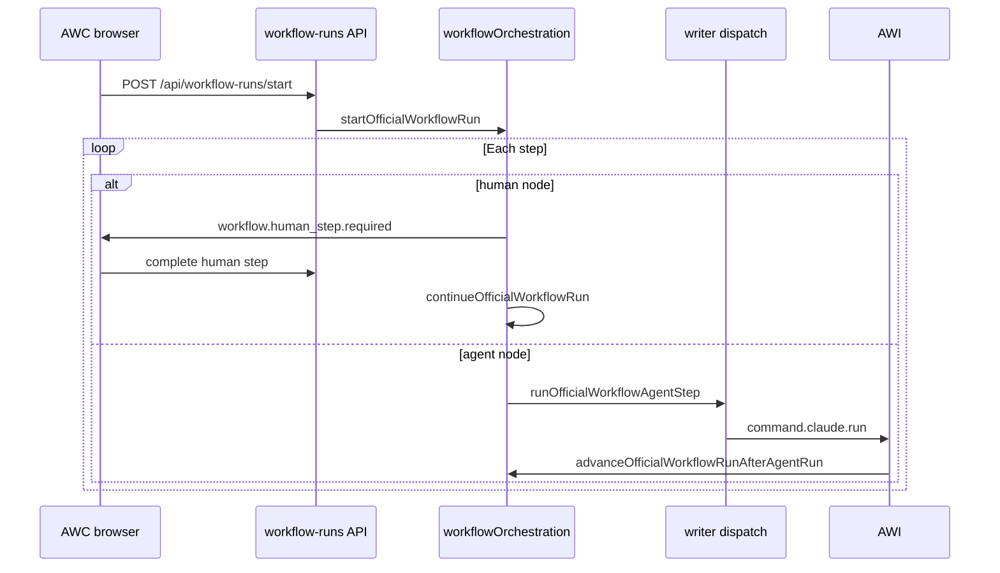

# Chapter 6 — Workflows and orchestration (developers)

How **official marketplace workflow runs** are orchestrated in **AWC** (Postgres + APIs) while **bounded agent steps** dispatch to the Mac like any other writer run. User-facing vocabulary: [user guide ch.6](../user-guide/06-workflows-and-checkpoints.md) (when present) and [docs/product/concepts.md](../../product/concepts.md).

---

## Two workflow execution modes

| Mode                       | When                                                                             | What runs on the Mac                                                                              |
| -------------------------- | -------------------------------------------------------------------------------- | ------------------------------------------------------------------------------------------------- |
| **User-created workflow**  | Capability type `workflow` without a registered `template-*` harness slug        | **One** `command.claude.run` with a composed prompt (operator steps embedded as text checkpoints) |
| **Official orchestration** | Marketplace preset with curated graph (`shouldUseOfficialWorkflowOrchestration`) | **One agent node at a time** — each node is a separate dispatch + `agent_run`                     |

Gate in code: `shouldUseOfficialWorkflowOrchestration` requires `CapabilityType.WORKFLOW` and `resolveTemplateIdFromHarnessSetSlug(harnessSetSlug) !== null` (`src/lib/workflowOrchestration/shouldUseOfficialWorkflowOrchestration.ts`).

Do **not** describe these as separate backends — they share dispatch, presence, and Reports (see [Chapter 5](05-dispatch-presence-and-runs.md) when present).

---

## Official graph model

- **Snapshot:** `workflow_runs.definition_snapshot` — parsed by `parseOfficialWorkflowDefinitionSnapshot` (version ≥ 1).
- **Nodes:** `human` (browser checkpoint) and `agent` (Mac/cloud sub-run).
- **Index:** `current_step_index` on the run row; `continueOfficialWorkflowRun` advances one node per call.
- **Outputs:** `workflow_runs.step_outputs[nodeId]` — human `response`, agent `outputPreview`.

Curated definitions live under `src/lib/workflowOrchestration/definitions/` and **must** be registered in `definitions/registry.ts`. Do not rely on `buildOfficialWorkflowDefinitionFromTemplate` alone for marketplace presets — see [official-marketplace-workflow-best-practices.md](../../product/official-marketplace-workflow-best-practices.md).

Human steps must **not** use `[[AWAITING_INPUT]]` for workflow gates; the platform pauses between graph nodes instead.

---

## Engine flow (happy path)

Key modules:

| Concern              | Location                                                                     |
| -------------------- | ---------------------------------------------------------------------------- |
| Start run            | `startOfficialWorkflowRun.ts`                                                |
| Advance graph        | `continueOfficialWorkflowRun.ts`                                             |
| Human pause          | `runOfficialWorkflowHumanStep.ts`, `completeOfficialWorkflowHumanStep.ts`    |
| Agent step           | `runOfficialWorkflowAgentStep.ts`, `renderOfficialWorkflowAgentPrompt.ts`    |
| After agent finishes | `advanceOfficialWorkflowRunAfterAgentRun.ts`                                 |
| Conditional skip     | `shouldSkipOfficialWorkflowAgentNode.ts`, `skipOfficialWorkflowAgentStep.ts` |
| UI payloads          | `broadcastWorkflowHumanStepRequired.ts`, `broadcastWorkflowStepFailed.ts`    |

Checkpoint UI: `WorkflowHumanStepModal`, `WorkflowAttentionBanner` under `src/features/dispatch/`.

---

## Checkpoints, skip, failure, retry

| Behavior               | Mechanism                                                                                          |
| ---------------------- | -------------------------------------------------------------------------------------------------- |
| Human pause            | Run status `waiting_human`; event `workflow.human_step.required`                                   |
| **Not now**            | Snooze; banner to resume later                                                                     |
| Optional human skip    | Human node `allowSkip` → `skipped: true` in step outputs                                           |
| Conditional agent skip | `skipWhenPriorResponseMatches` on agent node                                                       |
| Agent failure          | `advanceOfficialWorkflowRunAfterAgentRun` keeps step index; `workflow.step.failed`                 |
| Retry same step        | `POST /api/workflow-runs/retry-step` → `retryOfficialWorkflowRunStep` (only while status `failed`) |

Deep dive: [docs/qa/official-workflow-run-checkpoints-and-retry.md](../../qa/official-workflow-run-checkpoints-and-retry.md).

Example preset with repo validation: `vibe-coding-app-feature` (`vibeCodingAppFeature.definition.ts`) fails fast when `appTarget` is missing or not a git repo on the Mac.

---

## Builder vs orchestration (where to edit)

| You change                                | Touch                                                                                                   |
| ----------------------------------------- | ------------------------------------------------------------------------------------------------------- |
| Form field types, Create/Edit workflow UI | `src/features/workflows/`, `src/lib/workflows/`                                                         |
| Official preset graph or prompts          | `src/lib/workflowOrchestration/definitions/*`, harness/template under `src/lib/capabilities/templates/` |
| Dispatch payload / Mac routing            | [Chapter 5](05-dispatch-presence-and-runs.md), `src/lib/agentWitch/`                                    |
| Workflow run APIs                         | `src/app/api/workflow-runs/start/route.ts`, `retry-step/route.ts`                                       |

Field types and user-built vs official graph: [workflow-builder-field-types.md](../../qa/workflow-builder-field-types.md), [workflow-builder-form-and-graph.md](../../product/workflow-builder-form-and-graph.md).

File uploads and semantic output (when enabled): [workflow-file-upload-and-semantic-output.md](../../qa/workflow-file-upload-and-semantic-output.md).

---

## Tests and verification

- Per-preset: `src/lib/workflowOrchestration/definitions/<template-id>.definition.test.ts`
- Engine: `officialWorkflowRunEngineCheckpoints.test.ts`, `officialWorkflowRunEngineRetry.test.ts`
- After graph or dispatch changes: `npm run harness:bootstrap -- --workflow=verify`

Transport context (harness vs `command.claude.run`): [mac-harness-workflow-agent-dispatch.md](../../qa/mac-harness-workflow-agent-dispatch.md).

---

## Query aliases

- official workflow orchestration developer, workflow_runs definition_snapshot
- human checkpoint waiting_human retry-step API
- marketplace template graph workflowOrchestration
- user workflow one prompt vs official graph
- điều phối workflow Agent Witch, checkpoint human agent từng bước
- workflow chính thức marketplace, retry bước agent bị lỗi
- phân biệt workflow tự tạo một lần dispatch và graph server
