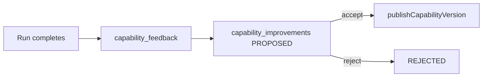

# Chapter 10 — Learning, memory, and improvements (developers)

Engineering view of **product pillars 2 and 3**: learn from usage (feedback → improvements) and efficient memory (Mac run context for the next **Task**). User vocabulary: [user guide ch.5](../user-guide/05-tasks-dispatch-and-runs.md), [ch.7](../user-guide/07-capabilities-library-playbooks.md). Pillars overview: [product-pillars.md](../../product/product-pillars.md). Honest gaps: [project-composition.md](../../architecture/project-composition.md) §1.9–1.10.

---

## Two different “memory” systems (do not conflate)

| System                                   | Audience                                     | Storage                                                                   | Purpose                                                                  |
| ---------------------------------------- | -------------------------------------------- | ------------------------------------------------------------------------- | ------------------------------------------------------------------------ |
| **Run memory (product)**                 | End users’ **Tasks** on a **project folder** | Mac: `memory/runs.ndjson` (via `resolveAgentWitchProjectKnowledgePaths`)  | Inject recent **Run** prompt/output into the next writer prompt          |
| **Repo RAG (product)**                   | Same Mac project folder                      | Mac/repo: RAG chunks (see `indexAgentWitchRagText`, `queryAgentWitchRag`) | Retrieve embedded snippets for dispatch context                          |
| **Feature-knowledge (repo agents only)** | Coding agents in **daily-magic** git         | `.feature-knowledge/index.json` (TF-IDF over `docs/**`, feature READMEs)  | `npm run feature-knowledge:query` — **not** shipped to Agent Witch users |

Confusing **feature-knowledge** with **run memory** is a common agent mistake: only the middle column affects production **Tasks** on a user’s Mac. See [agent-mistakes-catalog.md](agent-mistakes-catalog.md).

---

## Pillar 2 — Learn from usage (cloud loop)

**Intent:** Rough runs and feedback become **proposed** capability changes; humans accept or reject before publish.

| Layer               | Location                                                     | Notes                                               |
| ------------------- | ------------------------------------------------------------ | --------------------------------------------------- |
| Run feedback UI/API | `POST/GET /api/agent-runs/[runId]/feedback`                  | Reviewer must be run requester; gated by run status |
| Feedback inbox      | `/api/capabilities/feedback/inbox`                           | Owner triage                                        |
| Improvements inbox  | `/api/capabilities/improvements`                             | Lists `PROPOSED` rows                               |
| Draft from feedback | `/api/capabilities/feedback/[feedbackId]/improvements`       | Creates linked improvement                          |
| Accept / reject     | `acceptCapabilityImprovement`, `rejectCapabilityImprovement` | Accept publishes a **new capability version**       |

Feature slices: `src/features/feedback/`, `src/features/improvements/` · lib: `src/lib/feedback/`, `src/lib/improvements/`.

**Human-in-the-loop:** accepting an improvement calls `publishCapabilityVersion` — it does **not** silently rewrite harness files on the Mac. Install/sync paths stay [Chapter 7](07-capabilities-library-harness.md).

**Run UX honesty** (fallback CLI, missing writer key): [run-ux-honesty-strings.md](../../qa/run-ux-honesty-strings.md) — pillar 2 includes honest status copy, not only the improvements table.

---

## Pillar 3 — Efficient memory (Mac injection)

After a writer run, the Mac client may append context for the **same project folder** (and optional `projectId`):

| Step               | Module                         | Behavior                                                 |
| ------------------ | ------------------------------ | -------------------------------------------------------- |
| Read prior entries | `readAgentWitchMemoryEntries`  | NDJSON lines, malformed lines skipped                    |
| Append after run   | `appendAgentWitchMemoryEntry`  | Redacts via `redactTextForProjectKnowledge` before write |
| Prefix next prompt | `formatMemoryContextForPrompt` | Last **N** entries (default 5), truncated previews       |

Canonical implementation: `apps/live/features/memory/internal/core/agentWitchLocalMemory.ts` (re-exported from AWL memory public-api; invoked from `apps/install/entry/startAgentWitchClient.ts` after `command.claude.run`).

RAG indexing often runs in the same capture block (`indexAgentWitchRagText`) — **separate file**, same folder policy; do not treat RAG chunks as the improvements loop.

**Git worktree verdict (Mac, no cloud cost):** before `runWriterTask`, AWI captures a git snapshot; after `command.claude.result`, it appends a one-line verdict to the run report file `details` via `captureAgentWitchGitWorktreeSnapshot` and `formatAgentWitchGitWorktreeVerdict` (`apps/live/features/projects/internal/core/knowledge/`). This supports pillar 2 honest outcomes and pillar 3 selective memory without LLM judges — see [agentcore-lessons-zero-marginal-cost.md](../../product/agentcore-lessons-zero-marginal-cost.md) §2.

**Local telemetry (Mac, pillar 3):** `recordAgentWitchChunkRetrievals` increments per-chunk hits when `queryAgentWitchRag` selects chunks for dispatch. Failed runs call `recordAgentWitchErrorOccurrence` + `indexAgentWitchErrorKnowledgeText`. `computeAgentWitchKnowledgeSuggestions` surfaces thresholds (10× RAG without tool, 3× same error → tool then rule hints) on AWL `/knowledge` — **not** auto-accept; cloud `capability_improvements` stays pillar 2 human-in-the-loop.

**Playbooks / library** reuse capability definitions (pillar 3 + 4): saved prompts are not the same as automatic run memory — see [concepts.md](../../product/concepts.md) (Run memory vs Library).

---

## Today vs north star (be explicit in PRs and docs)

Copy this table when describing behavior; do not imply features that are not wired.

| Area             | Shipped today                                                                                                                                                                                          | North star (direction)                                                                         |
| ---------------- | ------------------------------------------------------------------------------------------------------------------------------------------------------------------------------------------------------ | ---------------------------------------------------------------------------------------------- |
| **Run memory**   | Recency-based prompt/output pairs injected regardless of run outcome; **git verdict** in Mac run report `details` when the folder is a git repo                                                        | Outcome-aware capture; failures excluded from injection; distillation + dedupe                 |
| **RAG**          | Append + cosine scan; **retrieval counts** in `usage-stats.json`; failed runs index `error-chunks.ndjson` and inject “past failures” on dispatch; AWL `/knowledge` shows usage + local tool/rule hints | Bounded store; linked tools; optional local router LLM before writer; no install-wide fallback |
| **Improvements** | Cloud `capability_improvements` + accept → new capability version                                                                                                                                      | Full loop from failed run → reviewed suggestion → playbook/workflow/harness update             |
| **Mac ↔ cloud**  | Memory stays on device; improvements are cloud                                                                                                                                                         | Explicit promotion gates; no implicit upload of run transcripts                                |

Architecture critique and target layers: [project-composition.md](../../architecture/project-composition.md) (Knowledge layer §2, §1.10).

---

## When you change this area

1. Query: `npm run feature-knowledge:query -- "run memory improvements feedback" --feature=docs`
2. Read `src/features/feedback/KNOWN_ISSUES.md` and `src/features/improvements/KNOWN_ISSUES.md` if present.
3. Mac capture path: [Chapter 4](04-mac-bridge-awl-awb-awi.md) + memory module under `apps/live/features/memory/`.
4. Dispatch/memory limits: [Chapter 5](05-dispatch-presence-and-runs.md) (cascade routing may cap memory entries).
5. Update **user guide** pillar chapters per [guide-maintenance.map.json](../guide-maintenance.map.json); run `npm run feature-knowledge:index` and commit `.feature-knowledge/index.json`.

---

## Query aliases

- Agent Witch run memory appendAgentWitchMemoryEntry capability_improvements
- feedback improvements human in the loop publishCapabilityVersion
- feature-knowledge vs run memory RAG project folder
- pillar 2 pillar 3 developer guide learn from usage efficient memory
- bo nho run Agent Witch, cai thien capability, feedback run, RAG tren Mac
