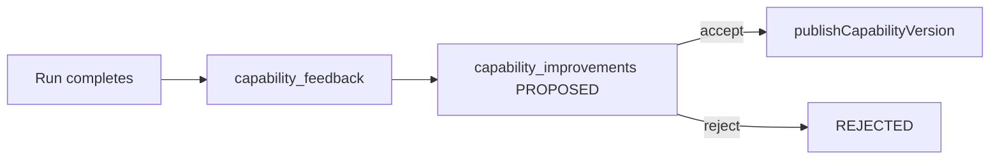

# Chapter 10 — Learning, memory, and improvements (developers)

Engineering view of **product pillars 2 and 3**: learn from usage (feedback → improvements) and efficient memory (Mac **episode notes** injected into the next **Task**). User vocabulary: [user guide ch.5](../user-guide/05-tasks-dispatch-and-runs.md), [ch.7](../user-guide/07-capabilities-library-playbooks.md). Pillars overview: [product-pillars.md](../../product/product-pillars.md). Names and flows for every learning pipeline (episode notes, knowledge candidates, Playbook skills, auto-skills): [learning-memory-terminology-and-flows.md](../../qa/learning-memory-terminology-and-flows.md).

> **Removed code (install bundle 281, 2026-10-08, commit `6ca713c2`).** The NDJSON run memory (`memory/runs.ndjson`, `appendAgentWitchMemoryEntry`, `formatMemoryContextForPrompt`), RAG chunks (`queryAgentWitchRag`, `indexAgentWitchRagText`), `error-chunks.ndjson` and `usage-stats.json` no longer exist; episode notes replaced them. Older docs still describe that path as "today" — notably [project-composition.md](../../architecture/project-composition.md) §1.9–1.10 and §2, and the weakness table in [local-rag-check-v2-design.md](../../design/local-rag-check-v2-design.md). Read them as history, not as current behavior.

---

## Memory and knowledge stores (do not conflate)

| System                                     | Audience                                     | Storage                                                                                                 | Purpose                                                                                                      |
| ------------------------------------------ | -------------------------------------------- | ------------------------------------------------------------------------------------------------------- | ------------------------------------------------------------------------------------------------------------ |
| **Episode notes (product)**                | End users’ **Tasks** on a **project folder** | Mac: profile-scoped `knowledge.db` → `episodes` (`apps/live/features/knowledge/internal/core/episode/`) | Inject a few budgeted `mistake` / `fix` notes into the next writer prompt                                    |
| **Shared episode notes (product, opt-in)** | Project owner (Console **Knowledge impact**) | Cloud `project_knowledge_cards`, written from the Mac heartbeat                                         | Owner-only list of redacted note text from members’ computers; only for folders with `knowledgeShare` **on** |
| **Feature-knowledge (repo agents only)**   | Coding agents in **daily-magic** git         | `.feature-knowledge/index.json` (TF-IDF over `docs/**`, feature READMEs)                                | `npm run feature-knowledge:query` — **not** shipped to Agent Witch users                                     |

Confusing **feature-knowledge** with **episode notes** is a common agent mistake: only the first two rows affect production **Tasks** or the Console. See [agent-mistakes-catalog.md](agent-mistakes-catalog.md).

---

## Pillar 2 — Learn from usage (cloud loop)

**Intent:** Rough runs and feedback become **proposed** capability changes; humans accept or reject before publish.

```mermaid
flowchart LR
  RUN[Run completes] --> FB[capability_feedback]
  FB --> IMP[capability_improvements PROPOSED]
  IMP -->|accept| PUB[publishCapabilityVersion]
  IMP -->|reject| REJ[REJECTED]
```

| Layer               | Location                                                     | Notes                                               |
| ------------------- | ------------------------------------------------------------ | --------------------------------------------------- |
| Run feedback UI/API | `POST/GET /api/agent-runs/[runId]/feedback`                  | Reviewer must be run requester; gated by run status |
| Feedback inbox      | `/api/capabilities/feedback/inbox`                           | Owner triage                                        |
| Improvements inbox  | `/api/capabilities/improvements`                             | Lists `PROPOSED` rows                               |
| Draft from feedback | `/api/capabilities/feedback/[feedbackId]/improvements`       | Creates linked improvement                          |
| Accept / reject     | `acceptCapabilityImprovement`, `rejectCapabilityImprovement` | Accept publishes a **new capability version**       |

Feature slices: `src/features/feedback/`, `src/features/improvements/` · lib: `src/lib/feedback/`, `src/lib/improvements/`.

**Human-in-the-loop:** accepting an improvement calls `publishCapabilityVersion` — it does **not** silently rewrite harness files on the computer. Install/sync paths stay [Chapter 7](07-capabilities-library-harness.md).

**Run UX honesty** (fallback CLI, missing writer key): [run-ux-honesty-strings.md](../../qa/run-ux-honesty-strings.md) — pillar 2 includes honest status copy, not only the improvements table.

---

## Pillar 3 — Efficient memory (Mac episode notes)

Every writer run on a project folder goes through a **check** before it and a **capture** after it. Both are fail-open: no SQLite, Ollama down or any exception means no notes, never a blocked or failed run. Modules below are in `apps/live/features/knowledge/internal/core/episode/`; the wiring is in `apps/install/entry/startAgentWitchClient.ts`.

| Step                   | Module                                                   | Behavior                                                                                                                                                                                                                                                                                                                                                              |
| ---------------------- | -------------------------------------------------------- | --------------------------------------------------------------------------------------------------------------------------------------------------------------------------------------------------------------------------------------------------------------------------------------------------------------------------------------------------------------------- |
| Plan                   | `resolveKnowledgePlan` (in `resolveWriterDispatchRoute`) | Skip on `cli_continue` or a `minimal` context budget. `chat` tasks: lexical search, ≤2 notes in 150 tokens. `code` tasks: hybrid (lexical + embedding), ≤3 notes in 300 tokens, or ≤6 in 800 when the budget is `full` or the run is a seeded continuation. Minimum score 0.3                                                                                         |
| Check before the run   | `checkKnowledgeBeforeTask`                               | Scores the project’s notes against the user prompt (embedding wait capped at 400 ms, then lexical only), packs to the token budget, prefixes the text to the prompt, records `injections` and one `knowledge_events` row                                                                                                                                              |
| User pushback          | `registerKnowledgeUserCorrection`                        | A prompt that corrects the previous run stores a `mistake` note and marks the notes injected into that run as ineffective                                                                                                                                                                                                                                             |
| Capture after the run  | `captureKnowledgeAfterRun`                               | Redacts prompt and output (`redactTextForProjectKnowledge`). Non-zero exit or a verify-failure line → `mistake` note (fingerprinted, deduped by content hash). New commits or changed files since the run started → `fix` note (`verified` with commits and no verify failure, else `unverified`). A revert commit supersedes the reverted notes and adds a `mistake` |
| Feedback on injections | `captureKnowledgeAfterRun`                               | Injected notes gain `useful_count` on a pass and `ineffective_count` when the same mistake repeats; `mistake_hits` records prevented vs repeated                                                                                                                                                                                                                      |
| Limits                 | `episode.types.ts`, `pruneEpisodes`                      | Takeaway ≤280 chars, request ≤200, ≤12 files per note, 2,000 notes per project (never-used notes are dropped first, then oldest)                                                                                                                                                                                                                                      |

Today only `mistake` and `fix` notes are written; `decision` and `lesson` exist in `EpisodeKind` for future capture.

**Controls.** Per project folder, `<project>/.agent-witch/token-saver.json`: `knowledge` (default `on`) and `knowledgeShare` (default `off`). Environment: `AGENT_WITCH_KNOWLEDGE=off` disables notes everywhere; `AGENT_WITCH_KNOWLEDGE_HOLDOUT_PERCENT` (0–100, default 10) sets a deterministic slice of runs (hash of the run id) that skips retrieval, so the impact numbers can compare repeat-mistake rates with and without notes.

**Git worktree verdict (Mac, no cloud cost):** before `runWriterTask`, AWI captures a git snapshot; after `command.claude.result`, it appends a one-line verdict to the run report file `details` via `captureAgentWitchGitWorktreeSnapshot` and `formatAgentWitchGitWorktreeVerdict` (`apps/live/features/projects/internal/core/knowledge/`). This supports pillar 2 honest outcomes and pillar 3 selective memory without LLM judges — see [agentcore-lessons-zero-marginal-cost.md](../../product/agentcore-lessons-zero-marginal-cost.md) §2. Episode capture reads git separately (`readGitRunChanges`) to link notes to commits.

**Impact and sharing (Mac → cloud).** AWL `/knowledge` renders the local impact panel (`buildKnowledgeImpactPanelHtml`, `summarizeKnowledgeImpact`). The heartbeat (`buildKnowledgeHeartbeatPayload`, aggregates at most every 10 minutes) sends per-project daily **counts** — runs, holdout runs, repeats with and without notes, injected tokens, mistakes avoided, estimated tokens saved — to `saveKnowledgeHeartbeat` for Console **Knowledge impact** (`src/features/projects/knowledge-impact/`). Note **text** goes up only for folders with `knowledgeShare` on (`buildKnowledgeSharedCards`: ≤20 notes per project per send, re-redacted, ≤4 file names each); turning it off lists the project in `shareOffProjectIds` so the server drops old copies.

**Knowledge candidates (separate from notes).** After a successful Run with a `projectId`, `distillProjectKnowledgeLesson` posts a redacted lesson, and the third occurrence of the same mistake posts `Recurring mistake (3x): …`, to `POST /api/agent-witch/projects/<id>/knowledge` (`syncProjectKnowledgeCandidateToCloud`). The owner promotes or rejects it in the Console — this is the explicit Mac → cloud gate, and it is not the pillar 2 improvements loop.

**Playbooks / library** reuse capability definitions (pillar 3 + 4): saved prompts are not the same as automatic notes — see [concepts.md](../../product/concepts.md) (Run memory vs Library).

---

## Today vs north star (be explicit in PRs and docs)

Copy this table when describing behavior; do not imply features that are not wired.

| Area              | Shipped today                                                                                                                                                                                                                                                           | North star (direction)                                                                       |
| ----------------- | ----------------------------------------------------------------------------------------------------------------------------------------------------------------------------------------------------------------------------------------------------------------------- | -------------------------------------------------------------------------------------------- |
| **Episode notes** | SQLite notes (`mistake`, `fix`) with hybrid lexical + embedding retrieval under a token budget; fail-open; commit linking and revert detection; useful / ineffective feedback; 10% holdout runs; AWL `/knowledge` impact panel; git verdict in Mac run report `details` | `decision` / `lesson` capture; promote strong notes to Playbook skills through an owner gate |
| **Failed runs**   | Never injected as raw output; a failed run yields a one-line `mistake` note, and the third repeat becomes a knowledge candidate                                                                                                                                         | Distillation across runs; dedupe across notes with different wording                         |
| **Improvements**  | Cloud `capability_improvements` + accept → new capability version                                                                                                                                                                                                       | Full loop from failed run → reviewed suggestion → playbook/workflow/harness update           |
| **Mac ↔ cloud**   | Notes stay on device by default; opt-in `knowledgeShare` sends redacted note text to the owner; impact counts always sent; knowledge candidates need owner promotion                                                                                                    | Explicit promotion gates; no implicit upload of run transcripts                              |

Architecture critique and target layers: [project-composition.md](../../architecture/project-composition.md) (written against the removed NDJSON path — see the note at the top of this chapter).

---

## When you change this area

1. Query: `npm run feature-knowledge:query -- "episode notes improvements feedback" --feature=docs`
2. Read `src/features/feedback/KNOWN_ISSUES.md` and `src/features/improvements/KNOWN_ISSUES.md` if present.
3. Mac capture path: [Chapter 4](04-mac-bridge-awl-awb-awi.md) + episode module under `apps/live/features/knowledge/`.
4. Dispatch/memory limits: [Chapter 5](05-dispatch-presence-and-runs.md) (`resolveWriterDispatchRoute` sets the `knowledgePlan`).
5. Update **user guide** pillar chapters per [guide-maintenance.map.json](../guide-maintenance.map.json); run `npm run feature-knowledge:index` and commit `.feature-knowledge/index.json`.

---

## Query aliases

- Agent Witch episode notes knowledge.db captureKnowledgeAfterRun checkKnowledgeBeforeTask
- run memory runs.ndjson appendAgentWitchMemoryEntry removed replaced by episode notes
- feedback improvements human in the loop publishCapabilityVersion
- feature-knowledge vs episode notes project folder
- pillar 2 pillar 3 developer guide learn from usage efficient memory
- bo nho run Agent Witch, cai thien capability, feedback run, ghi chu episode tren Mac
