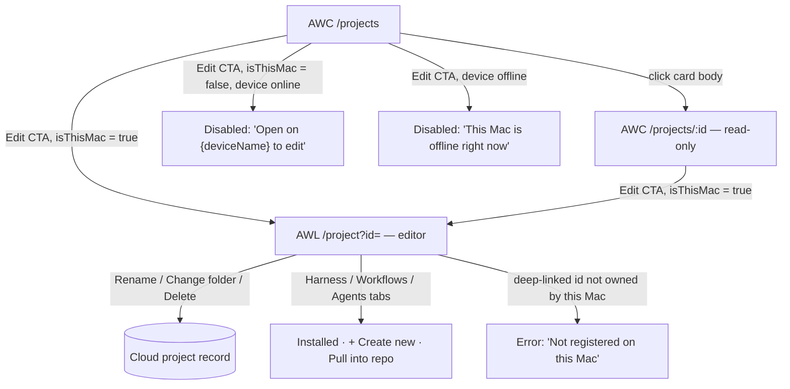
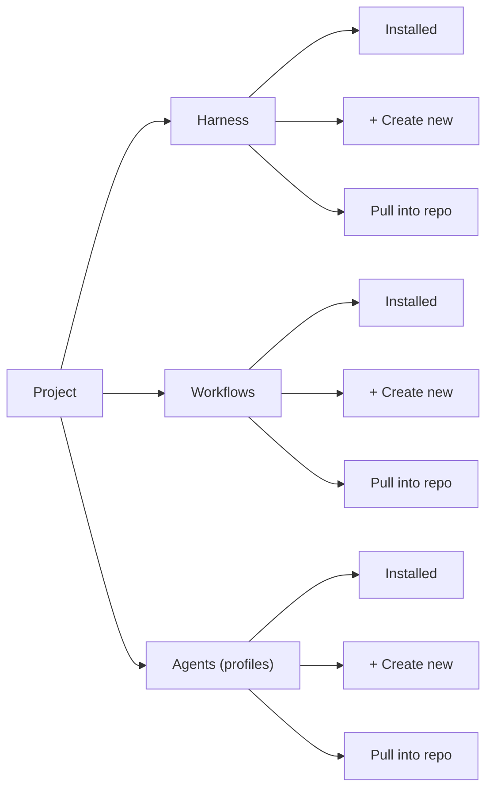

# Projects UX review — AWC list/detail vs AWL editor (v2 wireframes)

Design review of the Projects flow across **AWC** (`/projects`) and **AWL** (`/project?id=`). Audience: PM, design, engineering when building or changing these two surfaces. See [agent-witch-deployables.md](agent-witch-deployables.md) for AWC/AWL roles, [concepts.md](concepts.md) for Harness/Workflow/Capability definitions, and [ux-simplification.md](ux-simplification.md) for broader nav/naming direction (Playbooks, Repository).

**Constraints carried over from the brief:**

- AWC `/projects` — no delete, no folder picker; only **Edit** (hands off to AWL) and an optional read-only detail page.
- AWL `/project?id=` — full live edit: delete, folder, rename, and three composition types (Harness, Workflows, Agents), each with library/installed list + create + pull into repo.
- Projects show which **device** (`deviceId`) stores the repo.
- Hierarchy: **Project > Harness, Workflows, Agents**.

---

## 1. Critique of v1

v1 (prior agent): AWC list = cards with name, path, "Stored on: MacBook Pro", composition counts, `[Edit]` only. AWC detail = read-only sections + `[Edit on this Mac]`. AWL list = synced projects + `Open editor`. AWL editor = rename, folder, delete, three sections with library/create/pull.

| #   | Dimension             | Verdict | Problem                                                                                                                                                                                                | Fix in v2                                                                                                                                                                                           |
| --- | --------------------- | ------- | ------------------------------------------------------------------------------------------------------------------------------------------------------------------------------------------------------ | --------------------------------------------------------------------------------------------------------------------------------------------------------------------------------------------------- |
| 1   | Information hierarchy | `[x]`   | "Stored on: MacBook Pro" is static prose, not state. Two Macs can share a name; nothing tells you if it's _your_ current Mac.                                                                          | Device chip = status dot + name + "(this Mac)" suffix when the browser's pairing-token hash matches the device (same rule as `docs/qa/awc-how-browser-knows-this-computer.md`).                     |
| 2   | Cognitive load        | `[x]`   | Composition counts render on every row but aren't actionable from AWC (no drill-in editing allowed) — decoration that still costs scan time.                                                           | Keep counts as one compact chip line; never make them clickable in AWC; defer per-item detail to the read-only detail page.                                                                         |
| 3   | Mobile                | `[x]`   | No responsive behavior specified; path text, device prose, and two buttons per row will collide on narrow screens.                                                                                     | Cards stack full-width `<640px`; primary/secondary actions become full-width stacked buttons; device chip wraps under the name, never beside it.                                                    |
| 4   | Empty / error states  | `[x]`   | Zero-projects, zero-Mac, offline-device, and wrong-Mac states are entirely unaddressed.                                                                                                                | Explicit empty state (Connect a Mac / New project), explicit offline badge with "last seen", explicit wrong-Mac banner (see #8).                                                                    |
| 5   | Naming                | `[x]`   | `[Edit]` alone hides that the click leaves AWC for a loopback URL on one physical machine. `Agents` (the third composition type) collides with existing "agent run" language elsewhere in the product. | `Edit on this Mac →` / `Edit on {deviceName}`; flag `Agents` naming collision to product (see § 3).                                                                                                 |
| 6   | CTA clarity           | `[x]`   | `[Edit on this Mac]` is a single always-enabled button, even when the viewer isn't on that Mac — it will silently hang or fail against `127.0.0.1:43347`.                                              | Three-state CTA: enabled / disabled+reason / offline+reason (see § 3 table).                                                                                                                        |
| 7   | Parity AWC vs AWL     | `[x]`   | AWL list says "synced projects" with no defined scope — could list every cloud project regardless of owning device, inviting edits of a repo that lives on someone else's Mac.                         | AWL list is scoped to `deviceId == this Mac` (plus unbound Mac-only projects); header states the scope explicitly: "Projects on this Mac."                                                          |
| 8   | Wrong Mac             | `[x]`   | Not handled at all — the single biggest gap, since every AWC "Edit" is a hand-off to a loopback URL reachable from exactly one physical machine.                                                       | Identity-match badge drives CTA state everywhere (list, detail); AWL itself rejects a deep-linked project id it doesn't own with a clear message instead of a blank/wrong render.                   |
| 9   | Accessibility         | `[x]`   | Status implied by color dot alone; ambiguous whether "cards" are click targets (this repo's own a11y rule forbids `div role="button"`).                                                                | Status = icon + text, always; whole-card navigation uses a real `<a>`/`<button>`; disabled buttons carry `aria-describedby` pointing at the reason text; presence changes use `aria-live="polite"`. |
| 10  | Delete/folder leakage | `[~]`   | Correctly omits delete/folder from AWC, but gives no reason why sections are inert — rows invite a "why can't I click this" dead click.                                                                | Every read-only section carries a persistent "View-only here — edit on {deviceName}" note; rows are plain text, not fake buttons.                                                                   |

---

## 2. Design principles

1. **One editable source of truth per project.** Only AWL mutates. AWC always shows _why_ an action is unavailable instead of hiding or silently failing it.
2. **Device identity is state, not decoration.** Any screen offering an AWL hand-off reads and reacts to `isThisMac` / device presence tier — never a static label.
3. **Progressive disclosure of composition detail.** List = glance (counts only). Detail = read (names + versions). Editor = act (installed / create / pull). Never skip a level.
4. **No dead ends.** Every disabled control names the next step: switch Mac, connect Mac, set a folder first.
5. **Boring, real semantics.** Native `<button>` / `<a>`; status via icon + text; one primary CTA per screen.
6. **Same nouns, same order, everywhere.** Project > Harness > Workflows > Agents — same order in the AWC read-only page and the AWL editor tabs.
7. **Mobile is in scope for AWC, out of scope for AWL.** AWC list/detail degrade to single column with full-width tap targets; AWL is a Mac-only surface.

### Renamed labels

| v1                          | v2                                                                                                                                         | Why                                                                                                                                                                                               |
| --------------------------- | ------------------------------------------------------------------------------------------------------------------------------------------ | ------------------------------------------------------------------------------------------------------------------------------------------------------------------------------------------------- |
| `Edit`                      | `Edit on this Mac →` (enabled) / `Edit on {deviceName}` (disabled)                                                                         | Names the hand-off and the destination device before the click, not after it fails.                                                                                                               |
| `Stored on: MacBook Pro`    | `● Online here — {deviceName}` / `● Online — {deviceName}` / `○ Offline — {deviceName} · last seen …`                                      | State, not metadata; disambiguates duplicate device names via live status text.                                                                                                                   |
| AWL `Open editor`           | `Open project →`                                                                                                                           | The whole AWL page _is_ the project; "editor" implies a separate mode that doesn't exist.                                                                                                         |
| AWL "Library" (per section) | `Installed`                                                                                                                                | "Library" already means saved playbooks product-wide (`concepts.md`); reusing it inside a project for "what's currently installed" collides. `Installed` says exactly what the list shows.        |
| `Agents` (composition type) | **Flagged, not renamed** — keep `Agents` pending a product decision, but always pair with the subtitle _"agent profiles you can dispatch"_ | `Agents` already names two other things in this product: an agent run (an execution) and "the Mac side" colloquially. Recommend aligning with `concepts.md`'s `Capability` if this ships broadly. |

---

## 3. Identity-aware hand-off (the fix for "wrong Mac")



| CTA state            | Condition                                                                                 | Label                                | Behavior                                                                          |
| -------------------- | ----------------------------------------------------------------------------------------- | ------------------------------------ | --------------------------------------------------------------------------------- |
| Enabled              | `presenceTier` is `live` or `recent` **and** local pairing-token hash matches this device | `Edit on this Mac →`                 | Opens `http://127.0.0.1:43347/project?id={id}` in a new tab.                      |
| Disabled — wrong Mac | Device is online/recent but the hash does **not** match                                   | `Edit on this Mac` (greyed)          | Tooltip / inline note: `Open this page on {deviceName} to edit.` No click action. |
| Disabled — offline   | `presenceTier` is `offline`                                                               | `Edit on this Mac` (greyed)          | Inline note: `{deviceName} is offline right now · last seen {relative time}.`     |
| Reconnecting         | `presenceTier` is `live_other_instance`                                                   | `Edit on this Mac` (greyed, spinner) | Inline note: `Reconnecting…` — re-check before treating as fully offline.         |

### Composition hierarchy (Project > Harness/Workflows/Agents)



---

## 4. Revised wireframes

### A. AWC `/projects` — list (desktop)

```
┌──────────────────────────────────────────────────────────────────────────┐
│ Agent Witch                                                 [Account ▾]  │
├──────────────────────────────────────────────────────────────────────────┤
│ Projects                                                                  │
│ Repos your Macs can run agents against.                 [ + New project ]│
│                                                                            │
│ 🔍 Search projects…             Mac: [ All Macs ▾ ]                      │
├──────────────────────────────────────────────────────────────────────────┤
│  daily-magic                                                             │
│  ~/code/daily-magic                                                      │
│  ● Online here — Alex's MacBook Pro                                      │
│  3 Harness · 2 Workflows · 5 Agents                                      │
│                                    [ View details ]  [ Edit on this Mac → ]│
│  ── ── ── ── ── ── ── ── ── ── ── ── ── ── ── ── ── ── ── ── ── ── ──     │
│  wishees-app                                                             │
│  ~/code/wishees                                                          │
│  ● Online — Jamie's Mac mini                                             │
│  1 Harness · 0 Workflows · 2 Agents                                      │
│                     [ View details ]   [ Edit on this Mac ]  (disabled)  │
│                     ⓘ Open this page on Jamie's Mac mini to edit         │
│  ── ── ── ── ── ── ── ── ── ── ── ── ── ── ── ── ── ── ── ── ── ── ──     │
│  legacy-tools                                                            │
│  No folder set yet                                                      │
│  ○ Offline — Alex's Mac Studio · last seen 3 days ago                   │
│  0 Harness · 0 Workflows · 1 Agent                                      │
│                     [ View details ]   [ Edit on this Mac ]  (disabled)  │
│                     ⓘ Alex's Mac Studio is offline right now             │
└──────────────────────────────────────────────────────────────────────────┘
```

**Empty state**

```
┌──────────────────────────────────────────────────────────────────────────┐
│ Projects                                                                  │
│                                                                            │
│                        No projects yet.                                  │
│         Connect a Mac, then add the first repo it should work on.       │
│                                                                            │
│                 [ Connect a Mac ]      [ + New project ]                │
└──────────────────────────────────────────────────────────────────────────┘
```

**Mobile (`<640px`)**

```
┌───────────────────────────┐
│ Agent Witch        [ ☰ ]  │
├───────────────────────────┤
│ Projects                  │
│ [ + New project ]         │
│ 🔍 Search…                │
├───────────────────────────┤
│ daily-magic                │
│ ~/code/daily-magic         │
│ ● Online here               │
│ Alex's MacBook Pro          │
│ 3 Harness · 2 Workflows ·   │
│ 5 Agents                    │
│ ┌─────────────────────────┐│
│ │      View details       ││
│ └─────────────────────────┘│
│ ┌─────────────────────────┐│
│ │   Edit on this Mac →    ││
│ └─────────────────────────┘│
└───────────────────────────┘
```

### B. AWC `/projects/{id}` — read-only detail

```
┌──────────────────────────────────────────────────────────────────────────┐
│ Projects / daily-magic                                                   │
├──────────────────────────────────────────────────────────────────────────┤
│ daily-magic                                                              │
│ ~/code/daily-magic                                                       │
│ ● Online here — Alex's MacBook Pro              [ Edit on this Mac → ]  │
├──────────────────────────────────────────────────────────────────────────┤
│ Harness (3)                                     View-only — edit on Mac │
│  • check24-style-guide             v2.1                                 │
│  • conventional-commits            v1.0                                 │
│  • fsa-architecture                 v3.4                                │
├──────────────────────────────────────────────────────────────────────────┤
│ Workflows (2)                                   View-only — edit on Mac │
│  • Ship a feature                                                       │
│  • Fix a bug from an issue                                              │
├──────────────────────────────────────────────────────────────────────────┤
│ Agents (5) · profiles you can dispatch          View-only — edit on Mac │
│  • Release notes writer                                                 │
│  • PR reviewer                                                          │
│  • … +3 more                                                            │
├──────────────────────────────────────────────────────────────────────────┤
│ Linked Mac: Alex's MacBook Pro   ·   Added Sep 3, 2026                  │
└──────────────────────────────────────────────────────────────────────────┘
```

**Wrong-Mac banner (replaces the enabled button above when `isThisMac` is false)**

```
┌────────────────────────────────────────────────────────────────────────┐
│ ⓘ You're viewing this from Alex's iPhone. Editing works only from      │
│   Jamie's Mac mini — open this page there.        [ Edit ]  (disabled) │
└────────────────────────────────────────────────────────────────────────┘
```

**Empty section**

```
│ Harness (0)                                     View-only — edit on Mac │
│  No Harness installed yet.                                              │
```

### C. AWL `/projects` — list (this Mac)

```
┌──────────────────────────────────────────────────────────────────────────┐
│ Agent Witch — this Mac (Alex's MacBook Pro)                              │
├──────────────────────────────────────────────────────────────────────────┤
│ Projects on this Mac                                                     │
│ Repos this Mac can run Harness, Workflows, and Agents against.          │
│                                                         [ + Add project ]│
│ 🔍 Search…                                                                │
├──────────────────────────────────────────────────────────────────────────┤
│  daily-magic                                                            │
│  /Users/alex/code/daily-magic                                           │
│  ☁ Synced to Agent Witch Console                                        │
│  3 Harness · 2 Workflows · 5 Agents           [ Open project → ]        │
│  ── ── ── ── ── ── ── ── ── ── ── ── ── ── ── ── ── ── ── ── ── ── ──    │
│  scratch-experiments                                                    │
│  /Users/alex/code/scratch                                               │
│  ⚠ Local only — not visible in Agent Witch Console                      │
│  0 Harness · 0 Workflows · 0 Agents           [ Open project → ]        │
└──────────────────────────────────────────────────────────────────────────┘
```

**Empty state**

```
┌──────────────────────────────────────────────────────────────────────────┐
│ Projects on this Mac                                                     │
│                                                                            │
│              No projects on this Mac yet.                                │
│    Add a folder here, or add one from Agent Witch Console and choose    │
│                       this Mac to store it on.                           │
│                                                                            │
│                          [ + Add project ]                               │
└──────────────────────────────────────────────────────────────────────────┘
```

**Deep-link error (project id not owned by this Mac)**

```
┌────────────────────────────────────────────────────────────────────────┐
│ ⓘ This project isn't registered on this Mac.                           │
│   It may belong to a different Mac, or the link is out of date.        │
│                          [ Back to projects on this Mac ]              │
└────────────────────────────────────────────────────────────────────────┘
```

### D. AWL `/project?id=` — editor

```
┌──────────────────────────────────────────────────────────────────────────┐
│ Projects / daily-magic                                                   │
├──────────────────────────────────────────────────────────────────────────┤
│ daily-magic                                     [ ✎ Rename ]  [ Delete ]│
│ /Users/alex/code/daily-magic                    [ Change folder ]       │
│ ☁ Synced to Agent Witch Console                                        │
├──────────────────────────────────────────────────────────────────────────┤
│  [ Harness (3) ]    Workflows (2)    Agents (5)                         │
│  ──────────────                                                          │
│                                                                            │
│  Installed                                              [ + Create new ]│
│  ┌────────────────────────────────────────────────────────────────────┐│
│  │ check24-style-guide         v2.1               [ Update ] [ Remove ]││
│  │ conventional-commits        v1.0                          [ Remove ]││
│  │ fsa-architecture      v3.4 (update available)  [ Update ] [ Remove ]││
│  └────────────────────────────────────────────────────────────────────┘│
│                                                                            │
│  [ Pull into repo ▾ ]   from Marketplace or another project              │
├──────────────────────────────────────────────────────────────────────────┤
│ Last synced 2 minutes ago                                                │
└──────────────────────────────────────────────────────────────────────────┘
```

**Disabled state — no folder set yet**

```
┌──────────────────────────────────────────────────────────────────────────┐
│ new-project                                     [ ✎ Rename ]  [ Delete ]│
│ No folder set                                   [ Set folder → ]        │
├──────────────────────────────────────────────────────────────────────────┤
│ ⓘ Set a folder before installing Harness, Workflows, or Agents.          │
│                                                                            │
│  ( Harness )    ( Workflows )    ( Agents )        ← tabs greyed out    │
└──────────────────────────────────────────────────────────────────────────┘
```

**Delete confirmation (destructive action, typed confirmation)**

```
┌────────────────────────────────────────────┐
│ Delete "daily-magic"?                       │
│                                              │
│ This removes it from Agent Witch Console    │
│ and this Mac's project list. The folder on  │
│ disk is not deleted.                        │
│                                              │
│ Type the project name to confirm:           │
│ [ daily-magic____________ ]                 │
│                                              │
│               [ Cancel ]  [ Delete project ]│
└────────────────────────────────────────────┘
```

---

## 5. Sign-off — what changed from v1

- Replaced static `Stored on: {device}` text with a live device chip (status + name + "this Mac" match) everywhere a device is shown.
- Made the `Edit` CTA three-state (enabled / wrong-Mac-disabled / offline-disabled) instead of a single always-enabled button — this was the missing "wrong Mac" handling.
- Added an explicit ownership check on the AWL side: a project id this Mac doesn't own now renders an error, not a blank or mismatched page.
- Scoped the AWL list to "Projects on this Mac" instead of an ambiguous "synced projects," so users can't accidentally believe they can edit a teammate's Mac's repo.
- Added empty states for AWC list, AWL list, and empty composition sections — none existed in v1.
- Added a persistent "View-only — edit on {deviceName}" note to every read-only section instead of leaving rows looking like dead click targets.
- Compressed composition counts to a single glanceable line in the list view; kept item-level detail for the read-only detail page and editor only (progressive disclosure).
- Grouped Harness/Workflows/Agents as tabs in the AWL editor (was three stacked sections) to cut vertical scroll and make the "one project, three composition types" model visually explicit.
- Specified real accessible semantics: status by icon + text (not color alone), real link/button targets, `aria-describedby` on disabled CTAs explaining why.
- Defined a mobile layout for the AWC list (full-width stacked cards, full-width buttons) — AWL stays Mac-only, no mobile requirement.
- Flagged (did not silently rename) the `Agents` vs "agent run" naming collision for product to resolve; added disambiguating subtitle in the meantime.
- Added a typed-confirmation delete modal instead of a bare `[Delete]` button with undefined behavior.

I would sign off on this v2: every CTA now has a defined state for online/offline/wrong-Mac, every view has an empty state, and the AWC/AWL boundary (view vs edit) is enforced by disabled states with visible reasons rather than by convention alone.
