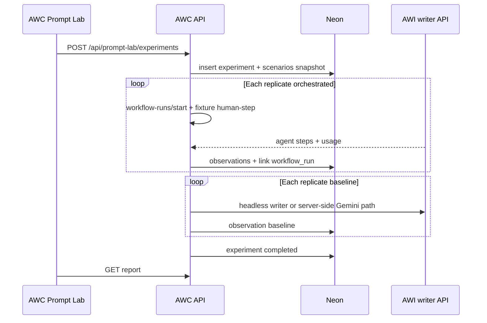

# Prompt Lab (MVP) — workflow evaluation on AgentWitch

**Status:** Agreed direction (dogfood slice). **Vertical:** official workflow `document-summary` first. **Pillar:** 2 (learn from usage) + evaluation gap vs external agent platforms.

## Problem

Teams ship **workflow graphs** (forms, checkpoints, per-step prompts, writer routing) without a built-in way to:

- Run fixed **scenarios** twice and see stability
- Compare **orchestrated** runs vs a **baseline** (e.g. one-shot same inputs)
- Persist **usage + full model output** for review (not only live run UI)
- Decide whether a workflow version is ready to publish

Ad-hoc scripts (local driver + `usage.ndjson` + DB polling) proved the loop but are not productized.

## Product name (working)

**Prompt Lab** (user-facing). Engineering: `prompt-lab` feature slice, tables prefixed `prompt_lab_*` or `eval_*`.

Do not promise “token savings” in copy; show **cost profile**, repeatability, and output review.

## MVP scope (A + one template)

| In scope                                                                     | Out of scope (later)            |
| ---------------------------------------------------------------------------- | ------------------------------- |
| Official workflow **`document-summary`** only                                | All 10+ official templates      |
| Scenario library (CRUD) per template                                         | Custom user-built graphs in v1  |
| Run **suite**: AW × `replicates` + baseline `raw_same_prompt` × `replicates` | LLM-as-judge, auto-promote      |
| Writer/model from run config (same as composer)                              | Cursor API billing              |
| Lab automation: **fixture checkpoint answers** (no browser typing)           | Production checkpoint UX change |
| Report: tokens, call count, spread, side-by-side finals                      | CI GitHub Action                |
| Export JSON/Markdown report link                                             | Regression gate on publish      |

**Default replicates:** 2 (matches token benchmark).

**Default checkpoint fixture:** short “approved, proceed with stated assumptions” (configurable per scenario).

## Core entities

1. **Scenario** — `template_id`, `label`, `field_values` (JSON), optional `checkpoint_responses[]`.
2. **Suite** — `template_id`, `orchestration_version` (pinned at run time), `baseline_kind` (`raw_same_prompt`), `replicates`, `writer_agent`, `model_profile` (writer API model id), `include_pre_estimate` (boolean; default matches production).
3. **Experiment** — one suite execution; status `running | completed | failed`.
4. **Observation** — one LLM call: `kind` (`estimate` | `agent_step` | `baseline`), `prompt_chars`, `usage` JSON, `response_text`, `model`, `latency_ms`, links `workflow_run_id` / `agent_run_id` / `workflow_step_run_id` when applicable.
5. **Report** — derived view: per-arm totals, spread %, links to observations (no separate store required for MVP).

## Baseline: `raw_same_prompt`

Build prompt from template marketing blurb + workflow field labels/values + instruction to produce the complete final result (same semantics as internal benchmark `build_raw_prompt`). Not identical to AW step prompts; document that in the report UI as **lower-bound cost reference**.

## Run flow (AWC + server)

**Authoritative status:** read experiment + `workflow_runs` from DB for lab runs; do not rely on stale in-memory workflow GET cache for driving checkpoints.

**Lab flag:** `source: prompt_lab` on workflow runs (column or `field_values` metadata) for filtering and analytics.

## Metrics (automated)

Per arm (orchestrated vs baseline), per scenario, aggregated across replicates:

| Metric                                                              | Notes                                 |
| ------------------------------------------------------------------- | ------------------------------------- |
| `total_tokens`, `prompt_tokens`, `output_tokens`, `thinking_tokens` | From writer usage metadata            |
| `llm_call_count`                                                    | Include estimate calls when enabled   |
| `estimate_token_share`                                              | When `include_pre_estimate`           |
| `spread_pct`                                                        | abs(r1−r2)/max(r1,r2) on total tokens |
| `wall_seconds`                                                      | Experiment wall time                  |
| `status`                                                            | completed / failed / partial          |

Optional v1.1 column: **wrapper tax** — prompt tokens minus estimated “user content only” size.

## Quality (human, MVP)

Report UI:

- Side-by-side **last agent step output** (orchestrated) vs **baseline output**
- Checkbox rubric for `document-summary` only, e.g. “Uses only source text”, “Matches requested length”, “Lists decisions/risks if asked”
- No auto-score in MVP

## UI (AWC)

Entry: Workflow template detail (official) → tab **Prompt Lab**.

1. **Scenarios** — list + editor (form fields mirror workflow).
2. **Run** — choose writer, replicates, toggle pre-estimate, start.
3. **Report** — table + expand rows + export.

## API sketch

| Method   | Path                                      | Purpose                 |
| -------- | ----------------------------------------- | ----------------------- |
| GET/POST | `/api/prompt-lab/scenarios?templateId=`   | CRUD scenarios          |
| POST     | `/api/prompt-lab/experiments`             | Start suite             |
| GET      | `/api/prompt-lab/experiments/[id]`        | Status + report payload |
| GET      | `/api/prompt-lab/experiments/[id]/export` | Markdown/JSON           |

Auth: same as capabilities (team user); scenarios may contain PII — no public sharing in MVP.

## Data model (MVP tables)

- `prompt_lab_scenarios` (id, owner_user_id, template_id, label, field_values, checkpoint_responses, created_at)
- `prompt_lab_experiments` (id, template_id, suite_snapshot jsonb, status, created_by, started_at, completed_at)
- `prompt_lab_observations` (id, experiment_id, scenario_id, replicate_index, arm, kind, model, usage jsonb, response_text, prompt_excerpt, links…, created_at)

Indexes: `(experiment_id)`, `(template_id, created_at desc)`.

## Code layout (FSA)

- `src/features/prompt-lab/` — UI sections, report components
- `src/features/prompt-lab/internal/` — suite runner, baseline prompt builder, aggregation
- `src/app/api/prompt-lab/...` — route handlers
- Reuse: `renderOfficialWorkflowAgentPrompt`, workflow start/human-step, writer usage parsers from install bundle types

## Dependencies / fixes to reuse from benchmark

- Persist **response text** on every writer API call used in lab (today optional in some paths).
- Fixture human-step must send `writerAgent` + `targetDeviceId` (see workflow checkpoint PR).
- Advance workflow from **step index**, not stale cached `currentStepIndex`.
- Consider storing **chosen writer** on `workflow_runs` for browser parity (follow-up).

## Success criteria (dogfood)

Internal team can:

1. Save two `document-summary` scenarios.
2. Run Prompt Lab with replicates=2.
3. Open report showing ~token ratio and output diff without shell access.
4. Export report for a marketing/engineering thread.

## Phases after MVP

| Phase | Deliverable                                                  |
| ----- | ------------------------------------------------------------ |
| v1.1  | More official templates; `include_pre_estimate` off profile  |
| v2    | Pin `definition_snapshot`; regression vs previous experiment |
| v2    | Publish gate on capability                                   |
| v3    | CI trigger; team golden suites                               |

## Related

- [product-pillars.md](product-pillars.md) — pillar 2, evaluations gap
- [agentcore-lessons-zero-marginal-cost.md](agentcore-lessons-zero-marginal-cost.md) — eval / scorecards
- Internal token benchmark (Sep 2025): orchestrated ~6.4× tokens vs `raw_same_prompt` on 9 workflows; quality mixed

**Last reviewed:** 2026-09-27
