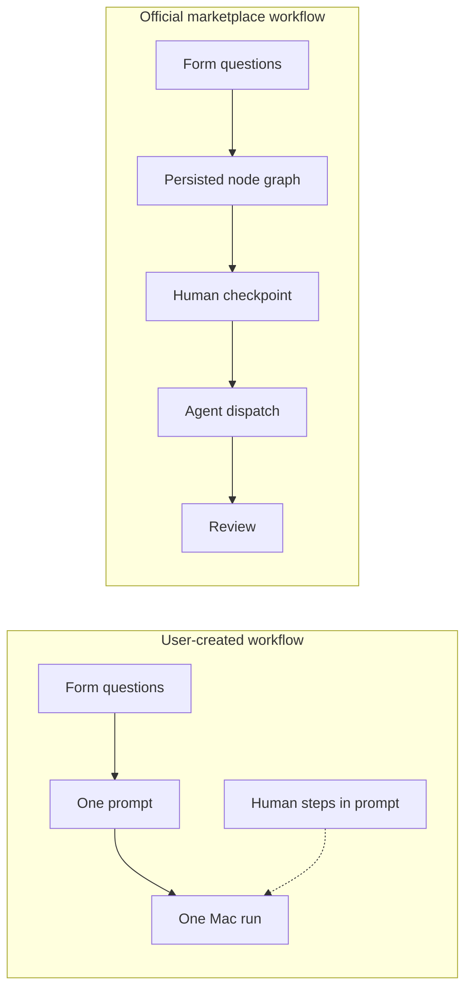
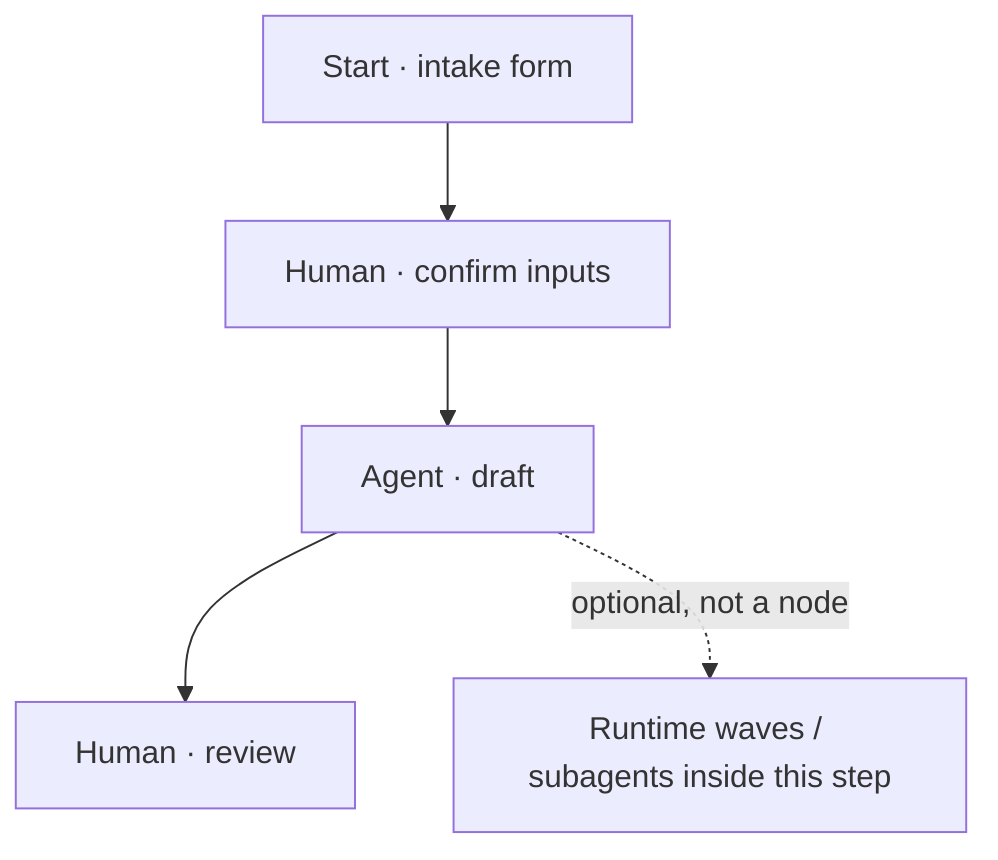

# Workflow / agent builder: form inputs, steps, and graph

**Status:** Proposed product analysis (no code change yet)  
**Audience:** PM, design, engineering deciding the next Create workflow / Create agent work  
**Surfaces:** AWC create/edit playbook (`CreateWorkflowForm`, `CreateAgentForm`), run-time form (`WorkflowTaskFields`), official orchestration (`workflow_runs`)

This document answers: _Can “Answer length” become real input types? Can create-flow look like a real workflow or agent, including a diagram with next nodes, subagents, and waves? What should we ship first?_

---

## 1. Verdict

**Yes — input types instead of “Answer length” is the right next step, and it is mostly already modeled.** The builder already stores a `type` on each question; the UI only exposes two values (`text` / `textarea`) and labels them as answer length.

**Yes — steps already exist, but they are hidden as “Extra rules for your Mac.”** Official marketplace workflows already run as a **linear human ↔ agent graph**. User-created workflows still collapse into **one Mac prompt**.

**A visual diagram is desirable and should be a later phase, not the first ship.** A full n8n-style canvas (freeform nodes, loops, branching, nested waves) is the wrong first product. A **linear graph** that reuses the official orchestration engine is the honest “looks like a workflow” target.

Do **not** treat **wave** as a node type the author drags onto the canvas. Waves already exist as a **runtime** plan the writer emits during a run (`[[WAVE_PLAN]]`). Authors should attach _permission_ (“this agent step may split into waves”) rather than drawing wave boxes.

---

## 2. What exists today

### 2.1 Two create surfaces

| Surface             | Collects                                                           | Does not collect                                             |
| ------------------- | ------------------------------------------------------------------ | ------------------------------------------------------------ |
| **Create workflow** | Name, notes, questions (`workflow_fields`), optional harness items | Graph definition, field widgets beyond one-line / multi-line |
| **Create agent**    | Name, notes, standing instructions, optional harness items         | Questions / form fields                                      |

Copy on Create workflow still says _“No automation canvas or code required.”_ That was a deliberate simplicity choice. It now conflicts with the goal of looking like a real workflow.

### 2.2 Questions are already form fields

Each question becomes:

1. A run-time form control when someone starts the workflow.
2. One line in the prompt sent to the Mac (`- Label: value`).

Schema (`published_capabilities.workflow_fields` JSONB):

```ts
{ key, label, type: "text" | "textarea" | "project", required }
```

| Type       | Builder UI       | Run UI                                  | Notes                      |
| ---------- | ---------------- | --------------------------------------- | -------------------------- |
| `text`     | “One line”       | `<input type="text">`                   | Default                    |
| `textarea` | “Multiple lines” | `<textarea>`                            | Same string value model    |
| `project`  | **Hidden**       | Hidden; filled from the selected folder | Marketplace templates only |

Values are always `Record<string, string>`. Validation is “required + trim,” nothing else.

The dropdown label is **Answer length** (`WORKFLOW_BUILDER_QUESTIONS_SECTION.inputTypeLabel`) even though the field is already `type`.

### 2.3 Steps already exist — three different meanings

| Noun in code                          | User-facing label today                       | What it actually is                                                       |
| ------------------------------------- | --------------------------------------------- | ------------------------------------------------------------------------- |
| Harness `operator`                    | **Human step** (buried under extra Mac rules) | Checklist for the person running the workflow; stored as `operator_steps` |
| Harness `agent`                       | **Specialist**                                | Subagent instructions copied onto the Mac under `~/.agent-witch/harness/` |
| Official graph node `human` / `agent` | Not in create UI                              | Server-orchestrated run: pause for human, then bounded Mac dispatch       |
| `[[WAVE_PLAN]]` / `[[WAVE_STATUS]]`   | Live run UI                                   | Writer-emitted work plan _during_ one agent step                          |

Official presets (Research brief, Vibe coding, …) already alternate **human checkpoint → agent step → review**. That graph is **hand-authored TypeScript** under `src/lib/workflowOrchestration/definitions/`. `startOfficialWorkflowRun` **rejects** user-created workflows (`This workflow is not an official orchestrated preset.`).

User-created operator steps are **appended to the single prompt** as checkpoints, not executed as a server graph.



### 2.4 Upload / files

There is **no** workflow file field, no blob table, and no dispatch path for an uploaded PDF/image. TailAdmin `DropZone` is a styleguide demo (`console.log`). The browser also cannot turn a file picker into a Mac POSIX path (same constraint as the project-folder picker).

---

## 3. What can be done

### 3.1 Input types (can and should)

Rename **Answer length → Input type** and extend `WorkflowFieldInputType`. JSONB + parser already default unknown types to `text`, so old rows stay valid.

**Ship in the first input-type PR (cheap, high leverage)**

| Type       | Widget                | Validation                    | Prompt serialization |
| ---------- | --------------------- | ----------------------------- | -------------------- |
| `text`     | One-line              | required, optional max length | as today             |
| `textarea` | Paragraph             | required, optional max length | as today             |
| `number`   | `input type="number"` | numeric, optional min/max     | decimal string       |
| `phone`    | Tel input             | E.164-ish / digits + `+`      | as entered           |
| `email`    | Email input           | RFC-light                     | as entered           |
| `url`      | URL input             | URL parse                     | as entered           |
| `select`   | Dropdown              | one of `options[]`            | option value         |
| `date`     | Date input            | ISO date                      | ISO date             |
| `boolean`  | Checkbox              | true/false                    | `yes` / `no`         |

Needs a small **field config** object (today the type has no extra keys):

```ts
{
  key, label, type, required,
  config?: {
    placeholder?: string;
    options?: readonly { value: string; label: string }[]; // select
    min?: number; max?: number; // number
    accept?: readonly string[]; // file mime / extensions
  }
}
```

Touch points (same change set): builder row, run-time `WorkflowTaskFields`, mobile stepper, `buildWorkflowFieldValidationErrors`, automations that copy field values, marketplace templates that want richer types.

**Do not ship in the first PR**

| Type                              | Why it is a different project                                            |
| --------------------------------- | ------------------------------------------------------------------------ |
| `file` / `image` / `pdf`          | Needs storage + how the Mac sees the bytes                               |
| `project` as a generic question   | Already a special binding to the selected folder; keep it platform-owned |
| Repeating groups / address blocks | Over-forms the builder; YAGNI until a real preset needs them             |

### 3.2 File upload (can, but only with an explicit storage story)

Three viable designs. Pick **one** before UI:

| Design                            | How it works                                                    | Fit for Agent Witch                                                                                           |
| --------------------------------- | --------------------------------------------------------------- | ------------------------------------------------------------------------------------------------------------- |
| **A. Extract text in AWC**        | Upload PDF/image → extract / OCR → store text in `field_values` | Best first file type: “attach a brief, agent reads it.” No Mac path problem.                                  |
| **B. Cloud blob + URL in prompt** | Store in object storage; prompt gets a signed URL               | Agent on Mac must be able to fetch the URL. Extra secrets, retention, size limits.                            |
| **C. Save onto the paired Mac**   | Browser → AWB → write under the project folder                  | True “here is the PDF on disk.” Only works when that Mac is online; same-machine constraint as folder picker. |

Recommendation: **A for v1 file fields** (PDF text + image caption/OCR or “image attached: filename, user must describe”). **C later** for “put this file in the repo.” Never pretend a browser `<input type="file">` is a Mac path.

### 3.3 Steps in the create UI (can and should, after or with input types)

Re-label the buried harness kinds as **workflow steps**:

| Add-step action              | Maps to                                                                                 |
| ---------------------------- | --------------------------------------------------------------------------------------- |
| Add question (already there) | `workflow_fields` — input to the _start_ of the run                                     |
| Add human step               | harness `operator` → `operator_steps`                                                   |
| Add agent step               | a named prompt section (today: `exampleRequest` `##` headings) plus optional specialist |
| Add specialist / subagent    | harness `agent` (instructions on the Mac)                                               |
| Add rule / skill / command   | keep as “playbook extras,” not graph nodes                                              |

Minimum honest editor (no canvas):

1. **Start** — questions form (the intake).
2. Ordered list of **Human** and **Agent** steps, add/remove/reorder.
3. **End** — optional Review human step (marketplace best practice).

That list can already be stored: operator items + exampleRequest sections. What is missing for user workflows is **running** that list as `workflow_runs` instead of one prompt.

### 3.4 Diagram (can later; should not block form types)

**Good first diagram:** a read-only or lightly editable **linear graph** of the same nodes official presets already use.



From each **agent** node, affordances:

- Edit the prompt for this phase.
- Attach a **specialist** (existing harness `agent` item).
- Toggle **“may split into waves”** (tells the writer to emit `[[WAVE_PLAN]]`; do not draw child wave nodes).

From each **human** node: short instructions (already the operator-step content).

**Defer:** freeform React Flow canvas, cycles, condition branches, parallel graph edges, nested subgraphs. Official definitions are a **flat array of nodes**. Branching would need a new schema (`edges`, conditions) and a new runner. That is a platform rewrite, not a builder skin.

### 3.5 Orchestration for user-created workflows (can; this is the real “feels like a workflow” unlock)

Today only `template-*` harness slugs start `workflow_runs`. To make a user-authored step list _execute_:

1. Persist a `OfficialWorkflowDefinition`-shaped snapshot on the capability (or generate it from steps, same as `buildOfficialWorkflowDefinitionFromTemplate`).
2. Allow `startOfficialWorkflowRun` (or a renamed `startWorkflowRun`) for owner-created workflows, not only marketplace templates.
3. Reuse human-step modal + agent-step dispatch already in AWC.

Without this, a pretty canvas is decoration: the Mac still receives one blob prompt.

---

## 4. What we should do (recommended sequence)

Ship in this order. Each phase is useful alone.

### Phase 1 — Form that looks like a form (do this first)

- Rename **Answer length → Input type**.
- Add `number`, `phone`, `email`, `url`, `select`, `date`, `boolean`.
- Optional `config` on the field definition; keep values as strings.
- Widgets + validation in builder **and** run UI (desktop + mobile stepper).
- Keep `project` platform-owned.

**Why first:** smallest diff, users feel it immediately when they _run_ the workflow, no new storage, no orchestration change.

### Phase 2 — File field (constrained)

- New type `file` with `accept: pdf | image`.
- Design A (extract text / caption) unless product explicitly needs Mac-disk files.
- Size cap, virus-scan-not-required but MIME allowlist, retention tied to the run.

### Phase 3 — Step editor for create workflow (and optionally create agent)

- Section **How this run proceeds** above “extra Mac rules.”
- Add Human step / Agent step; reorder.
- Default graph: Confirm inputs → Do the work → Review.
- Create agent can share the same step editor but skip the questions section (agent = standing specialist; workflow = form + steps).

### Phase 4 — Execute user graphs

- Generate/store definition; run through `workflow_runs`.
- Linear visual (cards + connectors, or a simple SVG/mermaid) in create **and** run history.

### Phase 5 — Only if Phase 4 is loved

- Light branching (“if review says rewrite, go back to agent”).
- Per-agent-node wave toggle and specialist picker on the node.
- Still not a general automation canvas.

---

## 5. What we should not do

- **Do not** keep the label “Answer length” if the control means input type.
- **Do not** build a freeform node canvas before user graphs actually run.
- **Do not** add Wave as a first-class authoring node. Waves are runtime parallelism inside an agent step.
- **Do not** use `[[AWAITING_INPUT]]` for workflow gates (already forbidden for official graphs; platform pauses between nodes).
- **Do not** dump file bytes into the prompt. Extract, URL, or Mac path — pick one.
- **Do not** expose `project` as just another question type in the generic dropdown.
- **Do not** make Create agent a second copy of the form builder; agents stay “standing specialist,” workflows stay “form + choreography.”

---

## 6. Product language (AWC)

Prefer user words from [UX simplification](ux-simplification.md):

| Avoid in UI             | Prefer                                            |
| ----------------------- | ------------------------------------------------- |
| Answer length           | **Input type**                                    |
| Capability / JSON field | **Question**                                      |
| Operator harness item   | **Human step**                                    |
| Harness agent item      | **Specialist** (or “Subagent” only in advanced)   |
| WAVE_PLAN               | **Work plan** on the live run, not in the builder |
| Automation canvas       | **Steps** / **How this workflow runs**            |

Create workflow blurb should change from “no canvas required” to: _Define the questions people answer, then the steps a person and the Mac take._

---

## 7. Risks

| Risk                                                    | Mitigation                                                                         |
| ------------------------------------------------------- | ---------------------------------------------------------------------------------- |
| Form types sprawl (address, repeating rows, signatures) | Phase 1 closed set; new types need a marketplace preset that needs them            |
| File upload vs Mac path confusion                       | Same rule as folder picker: browser file ≠ Mac path; document in Q&A when shipping |
| Step editor still one-shot dispatch                     | Do not advertise “diagram workflow” until Phase 4                                  |
| Official definitions stay TypeScript-only               | Phase 4 stores JSON snapshots like `definition_snapshot` on `workflow_runs`        |
| Agent vs workflow noun collision                        | Keep two create entry points; share step primitives                                |

---

## 8. Suggested first implementation slice (when approved)

1. Copy: `inputTypeLabel: "Input type"`; options Text / Paragraph (keep existing values).
2. Extend enum + parser + builder `<select>` + run widgets + tests for `number` and `phone`.
3. Stop. Review in product before select/date/file/canvas.

That slice is enough to prove the form direction without pretending we have a graph builder.

---

## Related

- [concepts.md](concepts.md) — workflow vs agent vs harness
- [official-marketplace-workflow-best-practices.md](official-marketplace-workflow-best-practices.md) — official graph shape
- [docs/qa/workflow-builder-field-types.md](../qa/workflow-builder-field-types.md) — how the builder works _today_
- Code: `src/features/workflows/WorkflowBuilderFieldRow.tsx`, `src/lib/workflows/types/WorkflowFieldDefinition.type.ts`, `src/lib/workflowOrchestration/`
