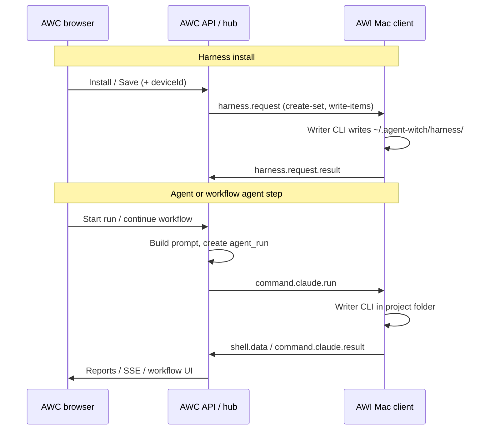

# How do harness, workflow, and agent runs reach the Mac?

## Query aliases

- harness workflow agent gui xuong mac bang cach nao
- how is harness installed on Mac
- marketplace install vs save to library Mac
- command.claude.run WebSocket dispatch
- HARNESS_REQUEST harness.request

## Short answer

**Harness** (rules/skills/commands under `~/.agent-witch/harness/`) is pushed over the **Agent Witch WebSocket** as `harness.request` messages; the Mac client (**AWI**) runs a writer CLI to create the set and write files. **Agent runs** and **workflow agent steps** do not copy the whole workflow to the Mac: metadata stays in **AWC** (Neon); each run sends a **`command.claude.run`** with a built **prompt** (and optional `projectFolderPath`, `capabilityId`, `agentRunId`). If the Mac is offline but recently seen, queueable messages go to the **dispatch outbox** and flush when the socket reconnects (ADR 0005).

## Details

### Transport (all Mac-bound commands)

| Piece                | Role                                                                             |
| -------------------- | -------------------------------------------------------------------------------- |
| **AWC**              | Cloud hub at `www.agentwitch.com`; holds capabilities, workflow runs, agent runs |
| **AWI**              | Mac install bundle; maintains `wss://<origin>/api/agent-witch/ws`                |
| **Hub**              | `getAgentWitchHub()` maps `userId` + `deviceId` → live `AgentWitchHubClient`     |
| **Deliver or queue** | `deliverOrQueueAgentWitchDispatchMessage` — send now or enqueue                  |

See `src/features/agent-witch/README.md` and ADR **0002** (WebSocket), **0005** (presence + outbox).

### Harness — what moves and when

| User action                             | Cloud                                                                                                     | Mac                                                       |
| --------------------------------------- | --------------------------------------------------------------------------------------------------------- | --------------------------------------------------------- |
| **Marketplace → Install** (with device) | `installOfficialPresetListing` → `pushHarnessInstallBundleToDevice`                                       | Receives `harness.request` (create-set, then write-items) |
| **Save to my library** (template fork)  | `createCapabilityFromTemplate` → `requestCapabilityTemplateHarnessInstall` (unless `deferHarnessInstall`) | Same bundle push when a target device is chosen           |
| **Run on your Mac** (harness catalog)   | Local wake API `POST …/harness/install` on **AWB** when browser and Mac share the machine                 | Bridge forwards harness install without cloud WS          |

Message builder: `buildHarnessInstallDispatchMessages` in `src/lib/harness/sendHarnessInstallToAgentClient.ts`.

Mac handler: `runHarnessRequest` in `apps/install/entry/startAgentWitchClient.ts` — ack → run writer CLI from `instruction` → `harness.request.result` → refresh manifest.

Harness is **files on disk**, not the execution graph.

### Workflow — what stays in cloud vs what runs on Mac

| Stored in AWC (Postgres)                                 | Sent per agent step                                                 |
| -------------------------------------------------------- | ------------------------------------------------------------------- |
| Capability + form values                                 | One **prompt** from `renderOfficialWorkflowAgentPrompt`             |
| Official graph (`officialWorkflowDefinition` on the run) | `dispatchClaudeRunForDashboardUser` → **`command.claude.run`**      |
| Human checkpoints                                        | **No Mac dispatch** — browser modal; responses persisted on the run |

Orchestration: `src/lib/workflowOrchestration/` (`startOfficialWorkflowRun`, `runOfficialWorkflowAgentStep`, `continueOfficialWorkflowRun`). User-built workflows without an official graph still dispatch as **one** agent run with operator steps embedded in the prompt (see `docs/product/workflow-builder-form-and-graph.md`).

### Agent (capability / task composer)

Same path as a single workflow agent step:

1. AWC creates an **agent run** record and builds payload (`buildClaudeDispatchPayloadFromBody`).
2. `dispatchClaudeRunForDashboardUserMac` resolves target Mac + policy.
3. Hub sends **`command.claude.run`** with `prompt`, `writerAgent`, `agentRunId`, etc.
4. Mac streams terminal output back (`shell.*`, `command.claude.result`); browser sees updates via APIs/SSE.

Workflow presets may also install harness **specialist** files (harness items tagged for agents) so the local CLI can use those instructions under `~/.agent-witch/harness/` — that is still the **harness** path above, separate from each `command.claude.run`.

### End-to-end diagram

### Offline Mac

If `resolveDispatchTargetAgentClient` finds no live socket but the device is **fresh** in the registry, `harness.request` and other queueable types are stored in **`agent_witch_dispatch_outbox`** and delivered after reconnect. The UI may show “queued” while the HTTP call already succeeded.

## Related

- [docs/product/concepts.md](../product/concepts.md) — Harness vs workflow vs capability
- [docs/qa/official-workflow-run-checkpoints-and-retry.md](official-workflow-run-checkpoints-and-retry.md)
- [docs/qa/awc-mac-reconnecting-vs-local-live.md](awc-mac-reconnecting-vs-local-live.md)
- [docs/adr/0005-shared-mac-presence-and-dispatch-outbox.md](../adr/0005-shared-mac-presence-and-dispatch-outbox.md)

## Last reviewed

2026-09-21
